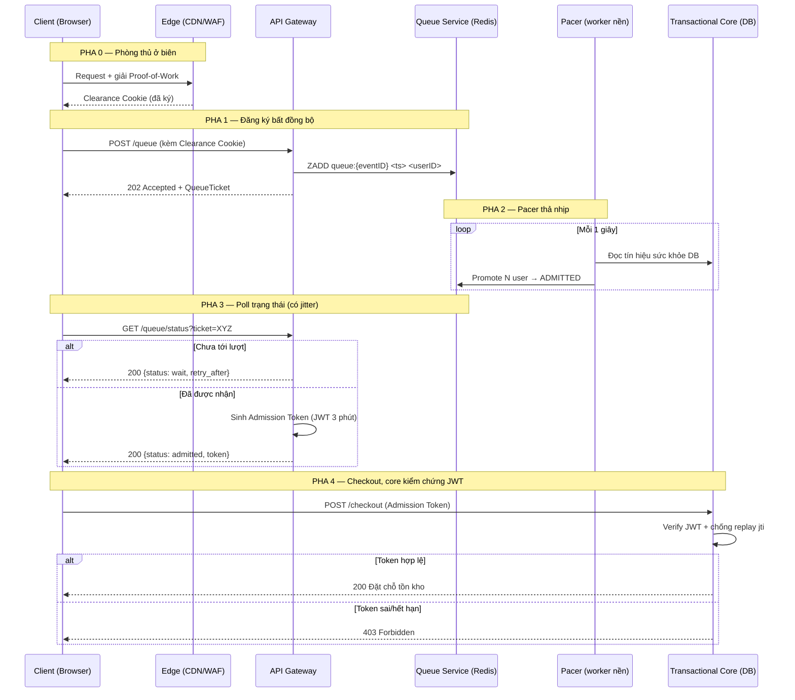

Ở [Phần 1](flash-sale-thundering-herd), chúng ta đã dùng lớp biên (edge) để bóp 1 triệu request thô — gồm bot, retry, double-click — xuống còn dòng người thật. Nhưng "thật" không có nghĩa là "phục vụ được ngay". Sau cơn bão đó, vẫn còn khoảng **100,000 con người hợp lệ** đang cùng lúc bấm "Mua" cho một lô hàng giới hạn.

Và đây là sự thật phũ phàng: **database giao dịch của bạn không thể xử lý 100,000 lượt checkout cùng một lúc một cách an toàn.** Nó có thể chịu được vài nghìn giao dịch/giây là cùng. Nếu bạn để cả 100,000 người đập thẳng vào core, DB sẽ nghẽn lock, latency tăng vọt, rồi sập — kéo theo cả những người lẽ ra đã mua được.

Vậy ta cần một thứ ở giữa. Nhiều người nghĩ "phòng chờ ảo" (virtual waiting room) là **nơi nhốt traffic bị từ chối**. Đó là cách hiểu sai và load-bearing nhất. Hãy reframe ngay từ đầu:

> Phòng chờ ảo **không phải** nơi chứa traffic bị loại. Nó là **vùng đệm (buffer) giữa nhu cầu hợp lệ và sức chứa an toàn của core.**

Giống như một hộp đêm nổi tiếng: bảo vệ ngoài cửa (edge) đã đuổi đám gây rối đi rồi. Nhưng bên trong sàn chỉ chứa được 500 người để còn thở được. 100,000 khách hợp lệ vẫn phải xếp hàng ngoài vỉa hè, và một người điều phối (Pacer) sẽ thả từng nhóm vào **đúng bằng tốc độ mà bên trong còn chỗ trống**. Đó chính là **Admission Control**.

## Bức tranh tổng thể: 5 pha của phễu nhập



## Phễu nhập (The Admission Funnel)

Hãy hình dung dòng người chảy qua bốn tầng, mỗi tầng hẹp hơn tầng trên — như một cái phễu:

1. **Cơn bão đến (1,000,000):** Người thật + bot + retry + double-click. Hỗn loạn.
2. **Người hợp lệ (100,000):** Sau khi lớp biên ở Phần 1 đã lọc bot và traffic rác. Đây là "nhu cầu thật".
3. **Lô được thả (N/giây, thích nghi):** Pacer cấp phát admission-token dựa trên **sức khỏe của core**. N không phải con số cố định — nó co giãn theo thời gian thực.
4. **Core giao dịch (sức chứa an toàn):** Reserve tồn kho + checkout. Chạy ở mức tải mà nó luôn an toàn.

Điểm mấu chốt: **mỗi tầng chỉ thả xuống tầng dưới đúng bằng lượng mà tầng dưới chịu được.** Phễu không bao giờ "ói ngược".

## Nguyên tắc 1 — Phòng thủ bot ở biên (Edge Bot Defense)

Traffic nguy hiểm nhất trong flash sale không phải người dùng háo hức, mà là **scalper bot** (bot đầu cơ gom hàng). Sai lầm kinh điển: dùng CPU của core để đánh giá xem một request có phải bot không. Bạn đang đốt tài nguyên đắt đỏ nhất để làm việc rẻ tiền nhất.

Đẩy việc đó ra **biên** (CDN/WAF), nơi rẻ và phân tán. Vũ khí gồm:

- **Proof-of-Work (PoW):** Buộc client giải một bài toán băm tốn CPU trước khi xin slot.
- **CAPTCHA vô hình** + **WAF heuristics**.
- **Device fingerprinting**, **account reputation**, **phân tích hành vi**.

Mô hình ở đây là **kinh tế học**, không phải tiêu diệt:

> Bạn không thể xoá sạch bot. Mục tiêu là **nâng chi phí vận hành của chúng** (CPU, hạ tầng proxy) lên cao đến mức việc gom hàng trở nên **không còn lời**.

Client nào vượt qua sẽ nhận một **Clearance Cookie** đã ký/mã hoá. Điều đẹp nhất: API Gateway có thể **xác thực cookie này bằng mật mã mà KHÔNG cần gọi core**. Một phép verify chữ ký cục bộ — không tốn một round-trip nào tới DB.

## Nguyên tắc 2 — Cái bẫy TCP bất đồng bộ (The Async TCP Trap)

Bản năng đầu tiên của nhiều kỹ sư: "Cho 100,000 người giữ một WebSocket, khi tới lượt thì push xuống." Nghe hợp lý. Và nó sẽ **giết server của bạn**.

Mỗi connection mở (HTTP giữ hay WebSocket) chiếm một **file descriptor**. Hệ điều hành có giới hạn `ulimit`. Giữ 100,000+ connection sống đồng thời → cạn file descriptor, đói thread của ứng dụng, và server từ chối cả những connection mới hợp lệ.

> Sai lầm chí mạng **không phải** là dùng WebSocket. Sai lầm là **buộc mỗi người đang chờ vào một tài nguyên backend khan hiếm.** WebSocket tự thân không xấu — cái xấu là sự ràng buộc (coupling).

Ví như thay vì bắt 100,000 người **cầm máy gọi điện chờ máy** (giữ đường dây), ta phát cho mỗi người một **số thứ tự** và bảo "cứ về chỗ, thỉnh thoảng quay lại hỏi". Đường dây được giải phóng ngay.

Giải pháp: **async polling có jitter**, tầng mạng của phòng chờ là **stateless**.

- **Pha 1 — JOIN:** `POST /queue` → backend `ZADD queue:{eventID} <timestamp> <userID>` → trả `202 Accepted` + QueueTicket → **đóng TCP ngay lập tức**. Ticket có TTL nghiêm ngặt (client bỏ ngang không được chiếm chỗ mãi mãi).
- **Pha 2 — POLL:** `GET /queue/status?ticket=XYZ` — nhưng **không poll mù**. Khoảng cách giữa các lần poll có **jitter** (độ lệch ngẫu nhiên), và server chủ động dẫn dắt qua header `retry_after`.
- **Pha 3 — CHECK (phía server):** `ZRANK` để lấy vị trí, trả `200 OK`, đóng connection. Jitter chính là thứ ngăn một **thundering herd thứ cấp** khi mọi người poll đồng bộ.

## Nguyên tắc 3 — Token nhập có chữ ký mật mã (The Cryptographic Admission Token)

Hàng đợi **không quản lý tồn kho**. Việc duy nhất của nó là **điều khiển tốc độ dòng chảy (flow rate)**. Khi một user được nâng lên trạng thái ADMITTED và poll, server sinh cho họ một **Admission Token** dạng JWT.

Vì sao phải là JWT chứ không phải một flag "đã được nhận" trong session?

> Core DB **không tin** một client tự khai "tôi đã được nhận rồi". Nó chỉ tin **bằng chứng mật mã.**

Đặc tính của token:

- **Sống ngắn** (ví dụ **3 phút**) — đủ để checkout, không đủ để chia sẻ lại.
- **Scope chặt**: gắn cứng vào `EventID + ProductID + UserID`.
- **`jti` duy nhất** (JWT ID) — dùng **một lần** lúc checkout, chống replay.
- Thiếu/sai/hết hạn → **403 Forbidden**.

Bất biến (invariant): **không ai vượt qua được phòng chờ.** Muốn vào core, phải có token, mà token chỉ phòng chờ mới phát.

### Demo Go — JOIN & POLL với Redis (Go 1.26)

```go
package queue

import (
	"context"
	"math/rand/v2"
	"time"

	"github.com/redis/go-redis/v9"
)

type Service struct {
	rdb *redis.Client
}

// joinQueue: ghi user vào sorted set theo timestamp, trả ticket + 202.
func (s *Service) joinQueue(ctx context.Context, eventID, userID string) (string, error) {
	key := "queue:" + eventID
	now := float64(time.Now().UnixNano())
	// ZAdd: score = timestamp → sorted set tự xếp theo thứ tự đến.
	if err := s.rdb.ZAdd(ctx, key, redis.Z{Score: now, Member: userID}).Err(); err != nil {
		return "", err
	}
	// TTL cho cả set: dọn rác sau khi sự kiện kết thúc.
	s.rdb.Expire(ctx, key, 2*time.Hour)
	return "tkt_" + eventID + "_" + userID, nil // QueueTicket
}

// pollStatus: lấy vị trí bằng ZRank, gợi ý retry_after kèm jitter.
func (s *Service) pollStatus(ctx context.Context, eventID, userID string) (rank int64, retryAfter int, err error) {
	rank, err = s.rdb.ZRank(ctx, "queue:"+eventID, userID).Result()
	if err != nil {
		return 0, 0, err // redis.Nil nghĩa là không còn trong hàng (đã được nhận)
	}
	// Jitter: 3s ± tối đa 2s → tránh mọi client poll cùng nhịp.
	retryAfter = 3 + rand.IntN(3)
	return rank, retryAfter, nil
}
```

### Demo Go — Sinh & xác thực Admission Token (JWT v5)

```go
package admission

import (
	"context"
	"errors"
	"time"

	"github.com/golang-jwt/jwt/v5"
	"github.com/redis/go-redis/v9"
)

type AdmissionClaims struct {
	EventID   string `json:"event_id"`
	ProductID string `json:"product_id"`
	UserID    string `json:"user_id"`
	jwt.RegisteredClaims
}

// issueToken: sinh JWT sống 3 phút, jti duy nhất, scope chặt.
func issueToken(secret []byte, eventID, productID, userID, jti string) (string, error) {
	claims := AdmissionClaims{
		EventID: eventID, ProductID: productID, UserID: userID,
		RegisteredClaims: jwt.RegisteredClaims{
			ID:        jti, // dùng một lần
			ExpiresAt: jwt.NewNumericDate(time.Now().Add(3 * time.Minute)),
			IssuedAt:  jwt.NewNumericDate(time.Now()),
		},
	}
	return jwt.NewWithClaims(jwt.SigningMethodHS256, claims).SignedString(secret)
}

// verifyToken: xác thực chữ ký + chống replay jti bằng Redis SET NX.
func verifyToken(ctx context.Context, rdb *redis.Client, secret []byte, raw string) (*AdmissionClaims, error) {
	c := &AdmissionClaims{}
	tok, err := jwt.ParseWithClaims(raw, c, func(t *jwt.Token) (any, error) { return secret, nil })
	if err != nil || !tok.Valid {
		return nil, errors.New("token không hợp lệ") // → 403
	}
	// SET NX: chỉ thành công LẦN ĐẦU. Lần sau cùng jti → false → replay bị chặn.
	ok, _ := rdb.SetNX(ctx, "jti:"+c.ID, "used", 5*time.Minute).Result()
	if !ok {
		return nil, errors.New("token đã dùng (replay)") // → 403
	}
	return c, nil
}
```

### Demo Go — Pacer: worker nền điều nhịp thích nghi

```go
package pacer

import (
	"context"
	"time"
)

// DBHealth: các tín hiệu Pacer đọc liên tục — KHÔNG có con số thả cứng.
type DBHealth struct {
	LatencyMs       float64 // độ trễ ghi trung bình
	ErrorRate       float64 // tỉ lệ lỗi 0..1
	QueueDepth      int64   // số người còn chờ
	CheckoutSuccess float64 // tỉ lệ checkout thành công 0..1
}

// computeRelease: từ sức khỏe DB suy ra số user được thả giây này.
func computeRelease(h DBHealth) int {
	base := 1000.0 // baseline an toàn
	switch {
	case h.ErrorRate > 0.02 || h.LatencyMs > 200: // DB đang ngộp → bóp van
		base *= 0.3
	case h.LatencyMs < 50 && h.CheckoutSuccess > 0.95: // DB khoẻ → mở thêm
		base *= 1.5
	}
	return int(base)
}

// Run: vòng lặp goroutine nền, mỗi 1s thả N user lên ADMITTED.
func Run(ctx context.Context, sample func() DBHealth, promote func(n int)) {
	ticker := time.NewTicker(1 * time.Second)
	defer ticker.Stop()
	for {
		select {
		case <-ctx.Done():
			return
		case <-ticker.C:
			n := computeRelease(sample()) // đọc tín hiệu thời gian thực
			promote(n)                    // nâng N user đầu hàng lên ADMITTED
		}
	}
}
```

## Mô phỏng: Phễu nhập & Bộ điều nhịp (Pacer)

Kéo thanh trượt để chỉnh **tốc độ thả N/giây**. Nếu N vượt quá sức chứa an toàn của core (~1500/giây), đồng hồ "Tải DB" sẽ chuyển đỏ — đúng công việc của Pacer là giữ van ở vùng an toàn.

<div class="ac-sim" style="border:1px solid var(--outlinegray);border-radius:14px;padding:20px 22px;margin:1.6em 0;background:var(--lightgray);font-family:var(--font-body)">
  <div style="display:flex;justify-content:space-between;margin-bottom:8px"><strong style="font-family:var(--font-header);color:var(--dark)">Phễu nhập &amp; Bộ điều nhịp (Pacer)</strong><span class="ac-verdict" style="font-size:.85em;padding:3px 10px;border-radius:999px;background:var(--secondary);color:#fff">DB an toàn</span></div>
  <canvas class="ac-canvas" width="700" height="300" style="width:100%;height:auto;display:block"></canvas>
  <div style="display:flex;align-items:center;gap:12px;margin-top:10px"><button class="ac-play" type="button" style="border:none;cursor:pointer;background:var(--secondary);color:#fff;border-radius:8px;padding:7px 14px;font-family:var(--font-body)">▶ Bắt đầu</button><input class="ac-slider" type="range" min="50" max="5000" value="800" style="flex:1;accent-color:var(--secondary)"></div>
  <div style="display:flex;justify-content:space-between;margin-top:8px;font-size:.85em;color:var(--gray)"><span class="ac-rate">Thả: 800/giây</span><span class="ac-queue">Còn chờ: 100000</span><span class="ac-admitted">Đã nhận: 0</span></div>
  <script>(function(){var root=document.currentScript.closest('.ac-sim');if(!root||root.dataset.init)return;root.dataset.init='1';var cv=root.querySelector('.ac-canvas'),ctx=cv.getContext('2d'),W=cv.width,H=cv.height;var btn=root.querySelector('.ac-play'),sl=root.querySelector('.ac-slider'),vd=root.querySelector('.ac-verdict'),rEl=root.querySelector('.ac-rate'),qEl=root.querySelector('.ac-queue'),aEl=root.querySelector('.ac-admitted');var SAFE=1500,TOTAL=100000,queue=TOTAL,admitted=0,running=false,raf=0;function css(v){return getComputedStyle(root).getPropertyValue(v).trim()||'#888';}function draw(){var dark=css('--dark'),gray=css('--gray'),acc=css('--secondary'),pri=css('--primary'),out=css('--outlinegray'),lg=css('--light');ctx.clearRect(0,0,W,H);var N=+sl.value,over=N>SAFE;rEl.textContent='Thả: '+N+'/giây';qEl.textContent='Còn chờ: '+queue;aEl.textContent='Đã nhận: '+admitted;ctx.fillStyle=gray;ctx.font='13px sans-serif';ctx.textAlign='center';ctx.fillText('Người hợp lệ đang chờ',180,24);var maxBarH=200,h=maxBarH*(queue/TOTAL);ctx.fillStyle=out;ctx.fillRect(90,40,180,maxBarH);ctx.fillStyle=pri;ctx.fillRect(90,40+(maxBarH-h),180,h);ctx.fillStyle=dark;ctx.font='bold 18px sans-serif';ctx.fillText(queue.toLocaleString(),180,40+maxBarH/2);ctx.strokeStyle=gray;ctx.lineWidth=2;ctx.beginPath();ctx.moveTo(270,140);ctx.lineTo(430,140);ctx.stroke();ctx.beginPath();ctx.moveTo(430,140);ctx.lineTo(420,134);ctx.lineTo(420,146);ctx.closePath();ctx.fillStyle=gray;ctx.fill();ctx.fillStyle=gray;ctx.font='12px sans-serif';ctx.fillText('Pacer thả '+N+'/giây',350,128);var gx=560,gy=140,gr=70;ctx.beginPath();ctx.arc(gx,gy,gr,0,Math.PI*2);ctx.lineWidth=16;ctx.strokeStyle=out;ctx.stroke();var load=Math.min(N/SAFE,1.4),frac=Math.min(load,1.4)/1.4;ctx.beginPath();ctx.arc(gx,gy,gr,-Math.PI/2,-Math.PI/2+frac*Math.PI*2);ctx.strokeStyle=over?acc:css('--tertiary');ctx.stroke();ctx.fillStyle=over?acc:dark;ctx.font='bold 16px sans-serif';ctx.fillText(over?'QUÁ TẢI':'AN TOÀN',gx,gy-4);ctx.fillStyle=gray;ctx.font='11px sans-serif';ctx.fillText('Tải DB',gx,gy+16);ctx.fillText('an toàn ≤ '+SAFE,gx,gy+gr+22);vd.textContent=over?'DB quá tải!':'DB an toàn';vd.style.background=over?acc:css('--tertiary');}function step(){if(!running)return;var N=+sl.value,rel=Math.min(Math.round(N/30),queue);queue-=rel;admitted+=rel;if(queue<=0){queue=0;running=false;btn.textContent='▶ Bắt đầu';}draw();raf=requestAnimationFrame(step);}btn.addEventListener('click',function(){if(queue<=0){queue=TOTAL;admitted=0;}running=!running;btn.textContent=running?'⏸ Tạm dừng':'▶ Bắt đầu';if(running)step();});sl.addEventListener('input',draw);draw();})();</script>
</div>

> Pacer là người gác van: không quan tâm có bao nhiêu người chờ, chỉ quan tâm core còn thở được bao nhiêu — và thả đúng bằng đó.

## Cạm bẫy thường gặp

- **Thundering herd thứ cấp do poll đồng bộ.** Nếu mọi client cùng poll mỗi 5 giây tròn, bạn vừa tạo ra một cơn bão mới mỗi 5 giây. **Khắc phục:** client không bao giờ poll mù — server trả `retry_after`, client cộng thêm **jitter** ngẫu nhiên; endpoint status được cache nhẹ vài giây với **key gắn theo ticket**; hoặc tách hẳn một service hàng đợi nhẹ — **không bao giờ để poll chạm vào core**.

- **JWT bị copy/chia sẻ.** Scalper bán lại token cho người khác. **Khắc phục:** token gắn cứng `UserID` + tín hiệu device/risk; lần checkout đầu tiên, middleware ghi `jti` vào KV ghi-nhanh (Redis/DynamoDB) với TTL; request sau cùng `jti` → **bị chặn tức thì là replay**.

- **Cụm Redis sập giữa sale.** Trạng thái hàng đợi là **vận hành (operational), không phải tài chính (financial)** — mất nó không mất tiền. Dùng replication + checkpoint. Nhưng nếu mất sạch: **FAIL CLOSED** — dừng nhận người, bảo vệ core DB, hiện UI rõ ràng ("Hàng đợi bị gián đoạn, đang khôi phục"), rồi mở lại cửa nhận. **Tuyệt đối không fail open** — thà không cho ai vào còn hơn xả 100,000 người thẳng vào DB.

- **Hot-key trên một sorted set toàn cục.** Một key `queue:global` duy nhất biến thành điểm nóng, mọi `ZADD/ZRANK` dồn về một shard. **Khắc phục:** **phân mảnh theo `EventID`/`Region`** → tải trải đều nhiều shard.

- **Công bằng ≠ FIFO tuyệt đối.** Trong hệ phân tán, **clock skew** giữa các node + network jitter khiến việc bắt chính xác mili-giây đến trở nên vô nghĩa. Tệ hơn, FIFO chính xác lại **dễ bị bot khai thác** (ai bắn request nhanh nhất thắng). **Khắc phục — Randomized Lottery Windows:** ai vào trong **30 giây đầu** đều rơi vào một **pre-queue ngẫu nhiên** (xổ số công bằng); người đến sau mới dùng FIFO chuẩn. Mục tiêu là **chống lạm dụng và giải thích được**, không phải công bằng theo thời khắc.

## Tóm tắt: Mental model

- **Tín hiệu (Signal):** Traffic hợp lệ vượt **cả** giới hạn connection vật lý **lẫn** throughput của DB. Đây là lúc bạn cần admission control.
- **Cấu trúc (Structure):** Edge Bot Defense + Async Polling (có jitter) + One-Time Admission Token (JWT).
- **Bất biến (Invariant):** DB luôn chạy ở mức tải an toàn thích nghi; không ai vượt qua admission; token không thể replay.
- **Insight cốt lõi (Pivot):** **Tách hàng đợi khỏi tồn kho.** Giữ trạng thái hàng đợi **bất đồng bộ** (không giữ connection); chặn herd thứ cấp bằng **jitter**; chuyển **bằng chứng mật mã** xuống core thay vì niềm tin.

> Phản xạ cần khắc cốt: **Admission control không phải là cho mọi người vào xếp hàng; nó là quyết định AI được đi tiếp, KHI NÀO, và với BẰNG CHỨNG mật mã gì.**

---
## Liên quan
- [[flash-sale-thundering-herd|Phần 1: Thundering Herd — Sống sót qua giây đầu tiên]]
- [[flash-sale-distributed-inventory|Phần 3: Tồn kho phân tán & Hot-Row]]
- [[flash-sale-payment-idempotency|Phần 4: Thanh toán & Idempotency phân tán]]
