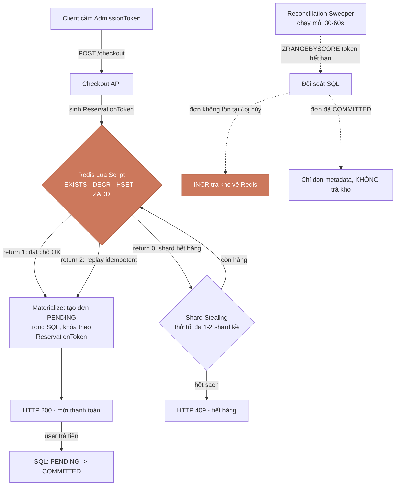

## Cái phễu đã dẫn ta tới đây

Hãy nhớ lại hình ảnh cái phễu của cả loạt bài này. **Phần 1** dựng tường ở biên (edge) và lọc bỏ 900.000 trong số 1.000.000 request thô. **Phần 2** dùng phòng chờ ảo (virtual waiting room) để nhả ra đúng 100.000 người đủ điều kiện một cách có kiểm soát. Và bây giờ, ở đáy phễu, ta đối mặt với thử thách thật sự: **10.000 người đang cầm token hợp lệ trong tay, cùng một khoảnh khắc, tranh nhau đúng 1.000 sản phẩm.**

Tất cả các lớp lọc phía trên chỉ để dồn áp lực xuống đây cho gọn. Giờ là lúc giải bài toán lõi: làm sao trừ kho cho 10.000 người đồng thời mà **không bao giờ bán quá 1.000 món**, lại **không làm sập hệ thống**.

Phản xạ tự nhiên của một backend engineer là viết một câu lệnh SQL trừ kho ngay trong checkout. Đó chính là **cái bẫy phá hoại nhất trong kiến trúc thương mại điện tử: bài toán Hot-Row (hàng nóng)**. Một dòng dữ liệu duy nhất bị 10.000 transaction tranh giành sẽ biến thành một nút thắt cổ chai, kéo sập cả nền tảng. Bài này sẽ mổ xẻ vì sao, và xây dựng một kiến trúc thay thế: Redis làm cổng đặt chỗ siêu tốc, SQL làm sổ cái bền vững, và một vòng lặp tự chữa lành (self-healing) khâu hai thế giới đó lại với nhau.

## Vòng đời của một lượt đặt chỗ



Ba luồng cùng tồn tại: **happy path** (xanh, từ trên xuống), **sold-out path** (nhánh shard stealing → 409), và **vòng chữa lành bất đồng bộ** (đường nét đứt của Sweeper). Hãy ghi nhớ bức tranh này; phần còn lại của bài chỉ là phóng to từng mảnh.

## (a) Hot Row là kẻ thù

Câu lệnh "ngây thơ" mà ai cũng nghĩ tới đầu tiên:

```sql
UPDATE inventory SET available = available - 1 WHERE sku_id = ? AND available > 0;
```

Nhìn thì hoàn hảo: `available > 0` đảm bảo không bao giờ âm. Nhưng hãy tưởng tượng cơ chế bên trong DB engine khi 10.000 request đập vào **cùng một dòng** `sku_id`:

- **T1** vào trước, lấy **khóa độc quyền (exclusive row lock)** trên dòng đó.
- **T2 đến T10000** không bị từ chối — chúng **xếp hàng** ngay bên trong engine, chờ T1 nhả khóa.
- Khóa được trao tay **tuần tự**: T1 xong → T2 → T3... Một hàng đợi nghiêm ngặt.

Hãy hình dung một quầy thu ngân duy nhất trong siêu thị giờ cao điểm, và 10.000 người chen vào đúng một quầy đó. Không ai bị đuổi ra, nhưng tốc độ phục vụ là **một người một lúc**. Hiệu ứng domino:

1. Transaction chờ quá lâu → **transaction timeout**.
2. Mỗi request đang chờ vẫn **giữ một kết nối** → **connection pool cạn kiệt**.
3. DB phải liên tục chuyển ngữ cảnh giữa hàng nghìn transaction treo → **CPU context-switch tăng vọt**.
4. Throughput của *toàn bộ* nền tảng (kể cả các SKU khác) **sụp về 0**.

Dòng hot-row không chỉ làm chậm SKU đó — nó là một điểm nghẽn duy nhất làm tê liệt cả hệ thống. **Nguyên tắc bất di bất dịch: không bao giờ để một dòng SQL biến thành hàng đợi serialize toàn cục.**

## (b) Reservation ≠ Commitment

Trước khi sửa, ta cần một học thuyết. Phải phân biệt rạch ròi hai loại sai:

- **Bán thiếu (underselling)** — ví dụ chấp nhận 995/1.000 đơn. Đây chỉ là **kém hiệu quả về kinh doanh**. 5 món còn lại sẽ được một cơ chế bù trừ bán nốt vài giây sau. Có thể **tự chữa lành**.
- **Bán quá (overselling)** — bán 1.001/1.000. Đây là **lỗi tính đúng đắn (correctness failure)**: hỏng dữ liệu chí tử, không thể vá. Bạn đã hứa bán một món **không tồn tại**.

Hai thứ này **không cân xứng**. Bán thiếu là vết xước có thể đánh bóng sau; bán quá là vết nứt kết cấu. Toàn bộ kiến trúc sẽ được thiết kế để **luôn nghiêng về phía bán thiếu** khi có nghi ngờ.

Từ đó tách biệt:
- **Reservation (đặt chỗ)** = quyền tạm thời được mua, có hạn sử dụng.
- **Commitment (chốt đơn)** = capture cuối cùng không thể đảo ngược, khi tiền đã chuyển.

**Redis = "Reservation Accelerator"** (bộ tăng tốc đặt chỗ): hấp thụ cơn bão, sàng lọc phần dư, chuyển kết quả đã được chứng thực xuống dưới. **SQL = system of record** (sổ cái sự thật). Redis nhanh nhưng dễ bay hơi; SQL chậm hơn nhưng là chân lý cuối cùng.

## (c) Atomic Reservation Gate

Nếu ta tách thành hai bước riêng — *DECR trên Redis* rồi *tạo đơn trên SQL* — sẽ lộ ra một lỗ hổng **dual-write** (ghi kép): nếu tiến trình **crash ngay sau khi DECR Redis nhưng trước khi ghi SQL**, ta vừa trừ một đơn vị kho **mà không có đơn nào tương ứng**. Đơn vị đó biến thành **"phantom stock"** (kho ma) — không bán được cho ai mà cũng không trả lại được.

Lời giải cho phần Redis: gom mọi thao tác vào **một Lua script** chạy **nguyên tử, không thể chia cắt** bên trong Redis. Trong lúc script chạy, không request nào khác chen vào được.

> **Lưu ý Redis Cluster (load-bearing):** ba key — `stock_key` (đếm kho), `reservation hash` (metadata), `expiry index` (ZSet) — **phải cùng một hash tag**, ví dụ `{HOT_SKU_SHARD_1}`. Redis Cluster băm phần trong `{}` để chọn slot; cùng hash tag ⇒ cùng slot ⇒ cùng node ⇒ Lua mới được phép động vào cả ba. Trên Redis dev một node, bỏ hash tag vẫn chạy — nên đây là cái bẫy *im lặng*.

```lua
-- Atomic inventory reservation. KEYS[1]=stock_key {SHARD}:stock, KEYS[2]=index_key {SHARD}:expiry_index, KEYS[3]=res_key {SHARD}:reservation:<token>
-- ARGV: 1=sku 2=user 3=shard 4=ttl_seconds 5=expiry_epoch 6=reservation_token
local stock_key = KEYS[1]
local index_key = KEYS[2]
local res_key = KEYS[3]
local sku, user, shard = ARGV[1], ARGV[2], ARGV[3]
local expiry = tonumber(ARGV[5])
local token = ARGV[6]
-- 0. Idempotency guard: cùng một token retry không được trừ kho hai lần
if redis.call('EXISTS', res_key) == 1 then return 2 end  -- 2 = replay idempotent, đã đặt trước
local current_stock = tonumber(redis.call('GET', stock_key))
if current_stock and current_stock > 0 then
  redis.call('DECR', stock_key)                                   -- 1. trừ kho
  redis.call('HSET', res_key, 'sku', sku, 'user', user, 'shard', shard, 'qty', 1, 'status', 'RESERVED', 'expiry', expiry)  -- 2. metadata cho Sweeper
  redis.call('EXPIRE', res_key, 86400)                            -- backstop 24h; Sweeper mới là người DEL
  redis.call('ZADD', index_key, expiry, token)                   -- 3. index token theo thời điểm hết hạn
  return 1                                                        -- 1 = đặt trước thành công
else
  return 0                                                        -- 0 = hết hàng
end
```

Ba cấu trúc dữ liệu, ba vai trò: **String** (`stock_key`) là bộ đếm kho; **Hash** (`res_key`) là *payload* cho Sweeper đọc về sau (biết sku/shard nào cần trả kho); **Sorted Set** (`index_key`, điểm số = thời điểm hết hạn) là *chỉ mục khám phá* để Sweeper tìm token đã hết hạn cực nhanh.

Gọi script từ Go với `redis.NewScript` (go-redis sẽ tự `EVALSHA`, tự fallback `EVAL` khi cache miss):

```go
// Go 1.26 — github.com/redis/go-redis/v9
package inventory

import (
	"context"
	"errors"
	"time"

	"github.com/redis/go-redis/v9"
)

// Nạp script một lần; reserveScript giữ sẵn SHA để EVALSHA.
var reserveScript = redis.NewScript(reserveLua) // reserveLua = chuỗi Lua ở trên

var (
	ErrSoldOut    = errors.New("shard hết hàng")
	ErrReserved   = errors.New("đặt chỗ thành công")
	ErrReplay     = errors.New("replay idempotent")
)

const (
	codeSoldOut  = 0
	codeReserved = 1
	codeReplay   = 2
)

// Reserve gọi Lua nguyên tử trên đúng shard. Trả về true nếu chỗ đã được giữ
// (mới giữ hoặc replay idempotent của cùng token).
func (s *Store) Reserve(ctx context.Context, shard ShardKey, skuID, userID, token string) (reserved bool, err error) {
	prefix := shard.Prefix() // ví dụ "{HOT_SKU_SHARD_1}"
	keys := []string{
		prefix + ":stock",
		prefix + ":expiry_index",
		prefix + ":reservation:" + token, // res_key sinh ở server, client KHÔNG được tự chọn
	}
	ttl := 10*time.Minute + 30*time.Second // 10' cửa sổ kinh doanh + 30" gia hạn kỹ thuật
	expiryEpoch := time.Now().Add(ttl).Unix()

	res, err := reserveScript.Run(ctx, s.rdb, keys,
		skuID, userID, string(shard), int(ttl.Seconds()), expiryEpoch, token).Int()
	if err != nil {
		return false, err
	}
	switch res {
	case codeReserved, codeReplay:
		return true, nil // cả hai đều coi như "đã có chỗ" — an toàn để materialize đơn
	case codeSoldOut:
		return false, ErrSoldOut
	default:
		return false, errors.New("mã trả về Lua lạ")
	}
}
```

Lưu ý `codeReplay` cũng trả `true`: nếu client retry với cùng `token`, ta **không trừ kho lần hai** mà vẫn cho đi tiếp materialize — đúng tinh thần idempotent.

## (d) Sharding tồn kho

Lua giải quyết được tính nguyên tử, nhưng **không** giải quyết được vấn đề vật lý: 10.000 request đập vào **đúng một key** vẫn là một **hot key** làm bão hòa CPU của một node Redis duy nhất. Atomic không có nghĩa là song song — Lua chạy *tuần tự* trên node đó.

Giải pháp: **chia 1.000 đơn vị thành 10 shard logic × 100 đơn vị**, rải trên cluster. Băm `UserID → chỉ số shard`, mỗi user mặc định đánh vào đúng một shard. Tải của 10.000 request giờ được trải đều ra 10 node thay vì dồn một chỗ.

Nhưng phân tải gây ra lệch cục bộ: shard của bạn có thể hết trong khi shard kế còn hàng. Đó là lúc dùng **Shard Stealing** (mượn shard): khi shard chỉ định báo hết, *thử* vài shard kề trên vòng băm trước khi tuyên bố hết sạch.

> **Giới hạn sống còn:** tối đa **1–2 lần dò ngẫu nhiên**, **không** dò tuyến tính qua mọi shard. Dò vô hạn = mỗi request thất bại lại quét cả 10 shard ⇒ ứng dụng của bạn tự biến thành một **"cỗ máy DDoS chính Redis của mình"** (internal thundering herd).

```go
// Băm userID -> shard, kèm shard-stealing có chặn (tối đa 2 lần dò kề).
package inventory

import (
	"context"
	"hash/fnv"
	"math/rand/v2"
)

const numShards = 10

type ShardKey int

func (k ShardKey) Prefix() string { /* trả "{HOT_SKU_SHARD_<k>}" */ return shardPrefix(k) }

// homeShard: shard "nhà" của user, ổn định theo userID.
func homeShard(userID string) ShardKey {
	h := fnv.New32a()
	_, _ = h.Write([]byte(userID))
	return ShardKey(h.Sum32() % numShards)
}

// ReserveWithStealing thử shard nhà trước, rồi mượn tối đa 2 shard ngẫu nhiên kề.
func (s *Store) ReserveWithStealing(ctx context.Context, skuID, userID, token string) (ShardKey, error) {
	home := homeShard(userID)
	if ok, err := s.Reserve(ctx, home, skuID, userID, token); err == nil && ok {
		return home, nil
	} else if err != nil && err != ErrSoldOut {
		return 0, err // lỗi hạ tầng — không nuốt
	}

	const maxProbes = 2 // CHẶN cứng: không bao giờ quét hết mọi shard
	for i := 0; i < maxProbes; i++ {
		probe := ShardKey((int(home) + 1 + rand.IntN(numShards-1)) % numShards)
		if ok, err := s.Reserve(ctx, probe, skuID, userID, token); err == nil && ok {
			return probe, nil
		} else if err != nil && err != ErrSoldOut {
			return 0, err
		}
	}
	return 0, ErrSoldOut // sau 1 nhà + 2 dò mà vẫn hết -> tuyên bố hết hàng (HTTP 409)
}
```

## (e) Reconciliation Sweeper

Triết lý cốt lõi của phần này: **thất bại không phải là ngoại lệ, nó là một trạng thái.** Thay vì cố bắt mọi exception ngay tại chỗ, ta thiết kế một vòng đời 4 pha trong đó "đặt chỗ rồi bỏ" là chuyện *bình thường*, và có một tiến trình nền dọn dẹp tất định.

1. **Reserve** — gọi Lua (mục c). Chỗ đã được giữ trên Redis.
2. **Materialize** — ghi một đơn **PENDING idempotent** vào SQL, khóa theo `ReservationToken` (unique). Nếu API crash *sau* Redis nhưng *trước* SQL → token sẽ hết hạn → Sweeper thấy **không có đơn bền vững** → trả kho. Đây chỉ là **bán thiếu tạm thời**, *không phải* bán quá. Ta đã chọn đúng phía của sự bất cân xứng.
3. **Commit** — user trả tiền trước hạn → SQL `PENDING → COMMITTED`.
4. **Release & Reconcile** — Sweeper `ZRANGEBYSCORE` để lấy các token đã hết hạn, đối chiếu SQL, và trả kho **đúng một lần**.

Quy tắc vàng của pha 4 là **"SQL-First Cancellation"**: trạng thái SQL là *quan tòa*, việc trả kho trên Redis chỉ là *hệ quả*. Ta luôn ra phán quyết trên SQL trước (một `UPDATE` có điều kiện), rồi mới đụng vào Redis.

```go
// Reconciliation Sweeper — goroutine nền, quét token hết hạn mỗi 30-60s.
package inventory

import (
	"context"
	"database/sql"
	"log/slog"
	"time"
)

func (s *Store) RunSweeper(ctx context.Context, db *sql.DB) {
	ticker := time.NewTicker(45 * time.Second) // trong khoảng 30-60s
	defer ticker.Stop()
	for {
		select {
		case <-ctx.Done():
			return
		case <-ticker.C:
			for shard := ShardKey(0); shard < numShards; shard++ {
				s.sweepShard(ctx, db, shard)
			}
		}
	}
}

func (s *Store) sweepShard(ctx context.Context, db *sql.DB, shard ShardKey) {
	indexKey := shard.Prefix() + ":expiry_index"
	now := float64(time.Now().Unix())
	// Lấy các token có expiry <= now (đã hết hạn) từ ZSet.
	tokens, err := s.rdb.ZRangeByScore(ctx, indexKey, &redis.ZRangeBy{
		Min: "-inf", Max: formatFloat(now), Count: 500,
	}).Result()
	if err != nil {
		slog.Error("sweeper: đọc expiry index lỗi", "shard", shard, "err", err)
		return
	}
	for _, token := range tokens {
		s.reconcileToken(ctx, db, shard, token)
	}
}

// reconcileToken: SQL phán quyết trước, Redis là hệ quả. Idempotent qua nhiều lần crash.
func (s *Store) reconcileToken(ctx context.Context, db *sql.DB, shard ShardKey, token string) {
	// Bước 1: chuyển trạng thái SQL có điều kiện — chỉ thắng nếu đơn còn PENDING & đã quá hạn.
	res, err := db.ExecContext(ctx, `
		UPDATE orders
		   SET status = 'CANCELLED_BY_SWEEPER', cancelled_at = NOW()
		 WHERE reservation_token = $1
		   AND status = 'PENDING'
		   AND reservation_expires_at < NOW()`, token)
	if err != nil {
		slog.Error("sweeper: update SQL lỗi", "token", token, "err", err)
		return // để lần quét sau thử lại
	}
	n, _ := res.RowsAffected()

	if n == 1 {
		// Nhánh A: ta vừa THẮNG cuộc hủy -> trả kho về Redis đúng một lần.
		s.releaseStock(ctx, shard, token)
		return
	}

	// Nhánh B/C: n == 0 -> đơn không còn PENDING. Phải hỏi trạng thái xác nhận
	// để phục hồi idempotent (có thể lần quét trước đã hủy nhưng crash trước khi trả kho).
	var confirmed string
	if err := db.QueryRowContext(ctx,
		`SELECT status FROM orders WHERE reservation_token = $1`, token,
	).Scan(&confirmed); err != nil {
		if err == sql.ErrNoRows {
			// Materialize chưa kịp chạy (API crash sau Redis, trước SQL) -> trả kho.
			s.releaseStock(ctx, shard, token)
		}
		return
	}
	switch confirmed {
	case "CANCELLED_BY_SWEEPER":
		// Lần trước đã hủy nhưng crash trước khi release -> VẪN phải trả kho (idempotent).
		s.releaseStock(ctx, shard, token)
	case "COMMITTED":
		// Sự thật nằm ở sổ cái SQL: hàng đã bán -> CHỈ dọn metadata Redis, TUYỆT ĐỐI không INCR.
		s.cleanRedisOnly(ctx, shard, token)
	}
}
```

`releaseStock` phải tự nó nguyên tử và **chỉ INCR khi hash `res_key` còn trạng thái `RESERVED`** (rồi mới `DEL` token khỏi ZSet và hash) — nếu không hai lần Sweeper chạy chồng nhau có thể trả kho hai lần (double refund). Đây cũng là một Lua script nhỏ, theo đúng tinh thần mục (c).

## Tồn kho phân tán — không bao giờ oversell

<div class="inv-sim" style="border:1px solid var(--outlinegray);border-radius:14px;padding:20px 22px;margin:1.6em 0;background:var(--lightgray);font-family:var(--font-body)">
  <div style="display:flex;justify-content:space-between;margin-bottom:8px"><strong style="font-family:var(--font-header);color:var(--dark)">Tồn kho phân tán</strong><span class="inv-verdict" style="font-size:.85em;padding:3px 10px;border-radius:999px;background:var(--secondary);color:#fff">Sẵn sàng</span></div>
  <canvas class="inv-canvas" width="700" height="280" style="width:100%;height:auto;display:block"></canvas>
  <div style="display:flex;align-items:center;gap:12px;margin-top:10px;flex-wrap:wrap"><button class="inv-fire" type="button" style="border:none;cursor:pointer;background:var(--secondary);color:#fff;border-radius:8px;padding:7px 14px;font-family:var(--font-body)">⚡ Bắn 10.000 request</button><button class="inv-reset" type="button" style="border:1px solid var(--outlinegray);cursor:pointer;background:var(--light);color:var(--dark);border-radius:8px;padding:7px 14px;font-family:var(--font-body)">Reset</button><label style="font-size:.82em;color:var(--gray);display:flex;align-items:center;gap:6px">Lệch tải <input class="inv-skew" type="range" min="0" max="100" value="25" style="vertical-align:middle"></label><span class="inv-steals" style="font-size:.8em;color:var(--gray)"></span></div>
  <script>(function(){var root=document.currentScript.closest('.inv-sim');if(!root||root.dataset.init)return;root.dataset.init='1';var cv=root.querySelector('.inv-canvas');var ctx=cv.getContext('2d');var verdict=root.querySelector('.inv-verdict');var steals=root.querySelector('.inv-steals');var fire=root.querySelector('.inv-fire');var reset=root.querySelector('.inv-reset');var skew=root.querySelector('.inv-skew');var N=10,PER=100,TOTAL=1000;var stock=[],sold=0,stealCount=0,flash=[];function css(v){return getComputedStyle(root).getPropertyValue(v).trim()||'#cc785c';}function init(){stock=[];for(var i=0;i<N;i++)stock[i]=PER;sold=0;stealCount=0;flash=[];draw();verdict.textContent='Sẵn sàng';steals.textContent='';}function hashUser(u,sk){var base=u%N;if(sk>0&&Math.random()*100<sk){base=Math.floor(Math.random()*Math.max(1,Math.floor(N*0.4)));}return base;}function tryReserve(home){if(stock[home]>0){stock[home]--;return true;}for(var p=0;p<2;p++){var probe=(home+1+Math.floor(Math.random()*(N-1)))%N;if(stock[probe]>0){stock[probe]--;stealCount++;flash.push({s:probe,t:performance.now()});return true;}}return false;}function fireBurst(){init();var sk=parseInt(skew.value,10);var reqs=10000;for(var i=0;i<reqs;i++){if(sold>=TOTAL)break;var home=hashUser(i,sk);if(tryReserve(home))sold++;}draw();var over=sold>TOTAL;verdict.style.background=over?css('--tertiary'):css('--secondary');verdict.textContent=(over?'❌ OVERSELL ':'✅ ')+'Đã bán '+sold+'/'+TOTAL+' — '+(over?'!!!':'0 oversell');steals.textContent='Shard stealing: '+stealCount+' lượt mượn shard kề';}function draw(){var W=cv.width,H=cv.height;ctx.clearRect(0,0,W,H);ctx.fillStyle=css('--light');ctx.fillRect(0,0,W,H);var pad=18,gap=10,bw=(W-pad*2-gap*(N-1))/N,maxH=H-70;var now=performance.now();for(var i=0;i<N;i++){var x=pad+i*(bw+gap);var ratio=stock[i]/PER;var bh=maxH*ratio;var y=H-40-bh;ctx.fillStyle=css('--outlinegray');ctx.fillRect(x,H-40-maxH,bw,maxH);var isFlash=flash.some(function(f){return f.s===i&&now-f.t<600;});ctx.fillStyle=isFlash?css('--tertiary'):css('--secondary');ctx.fillRect(x,y,bw,bh);ctx.fillStyle=css('--dark');ctx.font='11px '+(css('--font-body')||'sans-serif');ctx.textAlign='center';ctx.fillText(stock[i],x+bw/2,H-26);ctx.fillStyle=css('--gray');ctx.fillText('S'+i,x+bw/2,H-12);}ctx.fillStyle=css('--gray');ctx.textAlign='left';ctx.font='12px '+(css('--font-body')||'sans-serif');ctx.fillText('Còn lại mỗi shard (tổng kho 10×100 = 1000)',pad,16);}fire.addEventListener('click',fireBurst);reset.addEventListener('click',init);skew.addEventListener('input',function(){});init();})();</script>
</div>

> Bấm **Bắn 10.000 request**: mỗi request băm vào shard "nhà", nếu hết thì mượn tối đa 2 shard kề (cột nhấp nháy màu đậm). Dù bắn bao nhiêu hay kéo "Lệch tải" thế nào, ô **đã bán không bao giờ vượt 1000** — đó chính là bất biến mà kiến trúc này bảo vệ.

## Cạm bẫy thường gặp

- **Bẫy TTL (rò rỉ kho vĩnh viễn).** Cám dỗ lớn nhất: đặt `res_key` TTL = đúng cửa sổ kinh doanh (10 phút). Khi đó Redis sẽ **evict metadata đúng lúc Sweeper định đọc nó** — Sweeper thấy token trong ZSet nhưng hash sku/shard đã bay mất, *không biết phải INCR vào đâu* → đơn vị kho biến mất **vĩnh viễn**. **Cách sửa:** luôn dùng **backstop 24h (`TTL=86400`)**; chỉ Sweeper mới được `DEL` một cách tường minh sau khi đối soát xong.
- **Phantom stock do dual-write.** Crash giữa "DECR Redis" và "ghi đơn SQL" tạo kho ma. Đã chặn bằng Lua nguyên tử ở mục (c) + Sweeper trả kho khi không thấy đơn bền vững.
- **Sweeper crash-and-skip.** Sweeper thắng cuộc hủy (`RowsAffected=1`), set `CANCELLED_BY_SWEEPER`, rồi **crash trước khi release Redis**. Lần quét sau `RowsAffected=0` — nếu code chỉ release khi `==1` thì sẽ **bỏ qua**, đơn vị kẹt mãi mãi. **Cách sửa:** phục hồi idempotent — khi `==0`, *truy vấn trạng thái xác nhận*; nếu là `CANCELLED_BY_SWEEPER` thì **vẫn phải release**. Việc trả kho gắn với *trạng thái hủy đã xác nhận trong SQL*, **không** phải với *ai là người thực hiện hủy*.
- **Hot key vẫn còn dù đã dùng Lua.** Lua nguyên tử nhưng tuần tự — một key vẫn bão hòa một node. Bắt buộc **shard hóa kho + collocate bằng hash tag** để mỗi shard nằm gọn một slot/node.
- **Shard stealing vô hạn = thundering herd nội bộ.** Dò tuyến tính qua mọi shard biến app thành cỗ máy DDoS chính Redis của mình. **Chặn cứng 1–2 lần dò.**
- **Bán quá vĩnh viễn chí tử, bán thiếu chỉ tạm thời.** Mọi quyết định mơ hồ phải nghiêng về bán thiếu. 995/1000 sửa được; 1005/1000 thì không.
- **Hash tag im lặng trên dev, bắt buộc trên cluster.** Trên Redis một node, thiếu `{}` vẫn chạy — bạn sẽ chỉ phát hiện lỗi MOVED/CROSSSLOT khi lên production cluster. Đặt hash tag ngay từ đầu.

## Tóm tắt: Mental model

- **Tín hiệu (Signal):** ghi đồng thời mật độ cao vào *một dòng DB duy nhất* → transaction timeout, pool cạn, throughput về 0.
- **Cấu trúc (Structure):** Bounded-Consistency (chấp nhận lệch trong giới hạn) + Atomic Lua Reservations (trừ kho + index hết hạn nguyên tử) + Inventory Sharding (10×100) + Reconciliation Sweeper (vòng dọn nền).
- **Bất biến (Invariant):** DB **không bao giờ** được đóng vai hàng đợi serialize nóng. Tính đúng đắn là một *vòng đời* có lệch trong giới hạn, sự thật bền vững nằm ở SQL, và phục hồi là *tất định*.
- **Insight cốt lõi (Pivot):** đừng bắt dòng SQL hứng cơn bão. Bộ nhớ (Redis) lo các lượt đặt chỗ ngắn hạn; lưu trữ bền vững (SQL) ghi sự thật đã chốt; reconciliation khâu lại khoảng lệch.

> **Phản xạ cần khắc cốt:** Redis là chiến trường tốc độ. SQL là sổ cái bền vững. Reconciliation là vòng lặp chữa lành.

---
## Liên quan
- [[flash-sale-thundering-herd|Phần 1: Thundering Herd — Sống sót qua giây đầu tiên]]
- [[flash-sale-admission-control|Phần 2: Admission Control & Phòng chờ ảo]]
- [[flash-sale-payment-idempotency|Phần 4: Thanh toán & Idempotency phân tán]]
