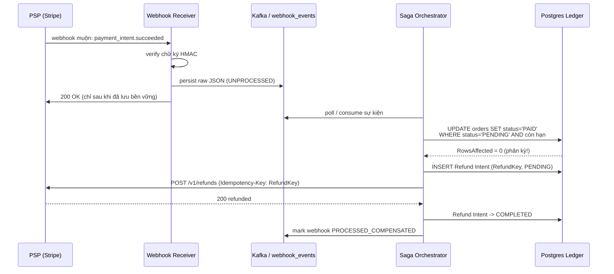

## Khoảnh khắc người dùng rút thẻ tín dụng

Suốt ba phần trước, ta đã xây một cỗ máy chịu tải khổng lồ: lớp biên hấp thụ 1 triệu request (Phần 1), phòng chờ ảo điều tiết 100k người vào trong (Phần 2), và một cổng tồn kho nguyên tử chống bán quá (Phần 3). Tất cả những thứ đó vẫn nằm **bên trong** vương quốc của bạn — DB của bạn, server của bạn, luật chơi của bạn.

Rồi người dùng bấm nút **"Pay"**.

Đây là khoảnh khắc bạn bước qua biên giới. Lệnh thanh toán rời khỏi hệ thống của bạn, bay qua Internet đến một **Payment Service Provider (PSP)** — một quốc gia có chủ quyền riêng, với database riêng mà bạn không bao giờ được phép khóa. Và đây cũng là nơi mọi thứ vỡ vụn: mạng không đáng tin, callback (webhook) về bất đồng bộ, và giữa hai thế giới đó hình thành cái gọi là **state divergence** — trạng thái phân kỳ. PSP nghĩ một đằng, DB của bạn nghĩ một nẻo.

Hãy hình dung gửi thư qua bưu điện quốc tế: bạn bỏ thư vào hòm, nhưng không có cách nào "khóa" tay người đưa thư và tay người nhận lại cùng một lúc để đảm bảo lá thư tới nơi. Bạn chỉ có thể gửi, rồi chờ một giấy báo phát (webhook) — mà giấy báo đó có thể tới muộn hai tiếng, tới hai lần, hoặc lạc đường.

Câu hỏi nhức nhối của phần này: **làm sao đảm bảo KHÔNG BAO GIỜ tính tiền 2 lần, dù người dùng sốt ruột bấm "Pay" 50 lần giữa lúc mạng đang phân vùng (network partition)?**

## Bức tranh tổng thể: Compensating Payment Saga

Trước khi đi vào chi tiết, hãy nhìn toàn cảnh luồng "bồi thường" (compensation) khi một thanh toán về muộn rơi trúng một đơn hàng đã bị huỷ:



Nhìn kỹ một chi tiết: PSP gọi đến, nhưng người nhận đầu tiên (Receiver) **không** xử lý ngay. Nó chỉ verify, lưu, rồi trả `200 OK`. Mọi logic nặng nằm ở Orchestrator chạy nền. Đây là kiến trúc xương sống của cả phần này.

## Câu chuyện "Ghost Payment" — bóng ma thanh toán

Để hiểu vì sao kiến trúc trên là bắt buộc, hãy theo dõi một dòng thời gian. Đây **không** phải một edge-case hiếm gặp — nó là một dị thường phân tán **tất yếu** sẽ xảy ra khi quy mô đủ lớn:

| Thời điểm | Sự kiện | Trạng thái đơn hàng |
|-----------|---------|----------------------|
| 9:55 | Người dùng bấm Pay, PSP **trừ tiền thẻ thành công**, nhưng webhook bị nghẽn ~2 phút | `PENDING` |
| 10:00 | TTL giữ chỗ hết hạn. Reconciliation Sweeper (Phần 3) huỷ đơn, **nhả hàng về kho** | `CANCELLED_BY_SWEEPER` |
| 10:01 | Một người dùng khác mua đúng món hàng vừa được nhả ra | hàng đã thuộc người khác |
| 11:55 | Webhook muộn "Payment Successful for Order X" **cuối cùng cũng tới** | tiền đã trừ, hàng đã bán |

Kết cục: khách bị trừ \$1000 cho một đơn đã huỷ, món hàng đã thuộc về người khác. Đây là một **vi phạm nghiêm trọng tính toàn vẹn dữ liệu và niềm tin khách hàng**. Bạn không thể "ngăn" nó xảy ra — webhook muộn là bản chất của mạng. Bạn chỉ có thể **thiết kế phản ứng**: tự động hoàn tiền.

## Khái niệm cốt lõi

### (a) Design for Compensation — Thiết kế để bồi thường

> "Trong hệ phân tán, bạn không ngăn được thất bại; bạn thiết kế cách bồi thường cho nó."

Phản xạ đầu tiên của một kỹ sư backend là: "Hãy làm một transaction nguyên tử bao trùm cả việc trừ tiền lẫn trừ kho." Đó là **2PC (Two-Phase Commit)**. Nhưng 2PC đòi hỏi khoá đồng thời tất cả các bên. Bạn **không thể khóa database của Stripe cùng lúc với Postgres của bạn** — đó là hai hệ thống có chủ quyền riêng. 2PC bị loại bỏ ngay từ đầu.

Thay vào đó ta dùng **Saga Pattern**: một chuỗi các giao dịch cục bộ (local transaction), mỗi giao dịch chỉ cập nhật một service rồi kích hoạt bước tiếp theo. Khi một bất biến bị vi phạm (ví dụ: thanh toán thành công cho đơn đã huỷ), ta chạy một **Compensating Transaction** — một giao dịch nghịch đảo để "gỡ" lại. Ở đây, compensating transaction chính là **lệnh hoàn tiền**.

Có hai cách điều phối Saga:

- **Choreography** (vũ đạo): các service tự lắng nghe sự kiện của nhau, không có nhạc trưởng. Linh hoạt nhưng logic rải rác, khó debug — như một dàn nhạc không có người chỉ huy, ai cũng phải đoán nhịp của người khác.
- **Orchestration** (điều phối tập trung): một tiến trình duy nhất nắm toàn bộ state machine. Như một nhạc trưởng cầm đũa.

Với bài toán tiền bạc, ta **chọn Orchestration**: một **Async Worker = Saga Orchestrator** duy nhất sở hữu toàn bộ máy trạng thái. Nó poll sự kiện webhook → cập nhật đơn hàng có điều kiện → phát hiện phân kỳ → phát lệnh hoàn tiền → ghi mọi chuyển trạng thái vào sổ cái bền vững.

### (b) Vòng đời của Idempotency Key

Idempotency key **không** chỉ là một `UNIQUE constraint` trong DB. Nó là một vòng đời trải dài giữa nhà cung cấp bên ngoài và sổ cái nội bộ. Mấu chốt: key phải **tất định (deterministic)** và **có phạm vi (scoped)** — cùng một thao tác phải luôn sinh ra cùng một key.

```
Charge      = Hash(OrderID + ReservationToken + PaymentAttempt + Amount)
Full Refund = Hash(PaymentIntentID + "FULL_REFUND")
Part Refund = Hash(PaymentIntentID + "REFUND" + Amount + Currency + Reason)
```

Vì sao charge key buộc phải có `ReservationToken`? Để retry không bao giờ đẻ ra một PaymentIntent trùng cho **cùng một lần giữ chỗ**, nhưng một lần giữ chỗ hợp lệ **về sau** vẫn có thể tạo ra một lần thử (attempt) khác biệt. Còn partial refund phải kèm `Amount + Reason` để hai khoản hoàn tiền khác nhau không bị PSP gộp nhầm thành một.

Ba giai đoạn của vòng đời:

1. **Derivation (Suy ra):** tính tất định, gắn với "hợp đồng giữ chỗ".
2. **Storage (Lưu trữ):** ghi vào Postgres `payment_idempotency_log` **TRƯỚC** khi gọi PSP. Đây là then chốt — nếu ta gọi PSP trước rồi mới ghi, một cú crash ở giữa sẽ khiến ta mất dấu vết.
3. **Expiration (Hết hạn):** key phía PSP hết hạn (Stripe ~24h). Nhưng sổ cái nội bộ giữ **vĩnh viễn** — để hai năm sau không bao giờ hoàn tiền trùng một giao dịch cũ.

### (c) Webhook Resilience — Tách Receiver / Processor

Đây là quyết định kiến trúc quan trọng nhất. Ta tách webhook làm **hai vai trò**:

**Webhook Receiver** (nhẹ, HA — high availability):
1. Verify chữ ký mật mã.
2. Lưu raw JSON vào một log append-only bền vững (`webhook_events` HOẶC Kafka topic).
3. Trả `200 OK` **CHỈ SAU KHI** chữ ký đã verify VÀ dữ liệu đã lưu bền vững. Nếu lưu thất bại → trả `5xx` để PSP **gửi lại** (redeliver).

**Processor / Async Worker** (chạy nền): poll, parse, chạy các bước chuyển trạng thái của Saga.

Vì sao phải ack `200 OK` ngay thay vì "xử lý xong rồi mới trả lời"? Vì nếu bạn gắn việc nhận webhook vào một transaction DB nặng nề, dưới tải flash-sale DB đang căng → transaction chậm → PSP timeout → PSP **retry dồn dập** → bạn tự DDoS chính mình. Tách **ingestion** (lo độ bền) khỏi **processing** (lo điều phối) để bảo vệ lớp biên và xử lý ở nhịp kiểm soát được.

Bất biến an toàn: **sự kiện webhook là đơn vị công việc bền vững; orchestrator là stateless.** Nếu một bước cục bộ giữa chừng thất bại → ta ném lỗi mà **không** đánh dấu webhook đã xử lý → nó vẫn `UNPROCESSED` → lần poll sau retry lại toàn bộ Saga. Mỗi bước phải idempotent: UPDATE có điều kiện lại trả `RowsAffected=0`; insert Refund Intent dùng `ON CONFLICT DO NOTHING`; lệnh PSP được dedupe bởi cùng một key.

### (d) Luồng bồi thường — Collision Check

Trái tim của Orchestrator là một câu UPDATE **có điều kiện**:

```sql
UPDATE orders
   SET status = 'PAID'
 WHERE id = $1
   AND status = 'PENDING'
   AND reservation_expires_at >= NOW();
```

Nếu `RowsAffected = 0`, ta soi trạng thái hiện tại để quyết định:

- `CANCELLED_BY_SWEEPER` (hoặc đã hết hạn) → **hoàn tiền** (compensate).
- đã `PAID` rồi → webhook trùng, đánh dấu OK, không làm gì.
- `REFUND_PENDING` → đã đang hoàn tiền, no-op idempotent.

## Lược đồ SQL

`webhook_events` là **hàng đợi công việc** (work queue) — đơn vị bền vững:

```sql
CREATE TABLE webhook_events (
    id               UUID        PRIMARY KEY DEFAULT gen_random_uuid(),
    psp_event_id     TEXT        NOT NULL UNIQUE,      -- ID sự kiện từ PSP; chặn nuốt trùng
    event_type       TEXT        NOT NULL,             -- vd 'payment_intent.succeeded'
    raw_payload      JSONB       NOT NULL,
    status           TEXT        NOT NULL DEFAULT 'UNPROCESSED',
        -- UNPROCESSED | IN_PROCESSING | PROCESSED_OK | PROCESSED_COMPENSATED | DEAD_LETTER
    processing_until TIMESTAMPTZ,                      -- hạn của optimistic lease
    created_at       TIMESTAMPTZ NOT NULL DEFAULT NOW(),
    processed_at     TIMESTAMPTZ
);
CREATE INDEX ON webhook_events (status, processing_until)
    WHERE status IN ('UNPROCESSED', 'IN_PROCESSING');
```

`payment_idempotency_log` là **sổ kiểm toán vĩnh viễn** (permanent audit trail):

```sql
CREATE TABLE payment_idempotency_log (
    idempotency_key TEXT        PRIMARY KEY,            -- hash của charge hoặc refund
    order_id        UUID        NOT NULL REFERENCES orders(id),
    operation_type  TEXT        NOT NULL,               -- 'CHARGE' | 'REFUND'
    amount_cents    BIGINT      NOT NULL,
    psp_response    JSONB,                              -- lưu sau khi PSP trả lời
    status          TEXT        NOT NULL DEFAULT 'PENDING',  -- PENDING | COMPLETED | FAILED
    created_at      TIMESTAMPTZ NOT NULL DEFAULT NOW(),
    completed_at    TIMESTAMPTZ
    -- KHÔNG có cột hết hạn: sổ kiểm toán tài chính giữ vĩnh viễn (PSP key hết hạn sau 24h; của ta giữ mãi)
);
```

## Cài đặt bằng Go (Go 1.26)

> Ghi chú quy mô: ở mức tải thấp/vừa, bạn có thể ghi webhook thẳng vào SQL. Nhưng ở mức ~10,000 webhooks/giây, kiểu nạp append-only qua **Kafka** an toàn hơn nhiều — nó làm phẳng tải (load leveling) và tránh vắt cạn connection pool của primary DB. Dưới đây dùng `franz-go`.

### Webhook Receiver — verify HMAC rồi đẩy vào Kafka

```go
package receiver

import (
	"context"
	"crypto/hmac"
	"crypto/sha256"
	"encoding/hex"
	"io"
	"net/http"
	"time"

	"github.com/twmb/franz-go/pkg/kgo"
)

type Receiver struct {
	kafka  *kgo.Client
	secret []byte // webhook signing secret của PSP
}

// verifySignature so sánh chữ ký bằng hằng-thời-gian để chống timing attack.
func (r *Receiver) verifySignature(body []byte, sigHex string) bool {
	mac := hmac.New(sha256.New, r.secret)
	mac.Write(body)
	expected := mac.Sum(nil)
	got, err := hex.DecodeString(sigHex)
	if err != nil {
		return false
	}
	return hmac.Equal(expected, got)
}

func (r *Receiver) Handle(w http.ResponseWriter, req *http.Request) {
	// Giới hạn thời gian đọc + produce để không treo connection của PSP.
	ctx, cancel := context.WithTimeout(req.Context(), 5*time.Second)
	defer cancel()

	body, err := io.ReadAll(io.LimitReader(req.Body, 1<<20)) // chặn payload quá khổ
	if err != nil {
		w.WriteHeader(http.StatusBadRequest)
		return
	}

	// Bước 1: verify chữ ký. Sai chữ ký -> 400, KHÔNG retry.
	if !r.verifySignature(body, req.Header.Get("PSP-Signature")) {
		w.WriteHeader(http.StatusBadRequest)
		return
	}

	// Bước 2: đẩy raw event vào Kafka. Dùng psp_event_id làm key để cùng một
	// sự kiện luôn rơi vào cùng partition (giữ thứ tự, hỗ trợ dedupe phía sau).
	rec := &kgo.Record{
		Topic: "payment.webhooks",
		Key:   []byte(req.Header.Get("PSP-Event-Id")),
		Value: body,
	}

	// ProduceSync: chỉ trả về sau khi broker đã ack ghi bền vững.
	if err := r.kafka.ProduceSync(ctx, rec).FirstErr(); err != nil {
		// Lưu thất bại -> 5xx để PSP GỬI LẠI. Tuyệt đối không nuốt sự kiện.
		w.WriteHeader(http.StatusServiceUnavailable)
		return
	}

	// Bước 3: chỉ 200 OK SAU KHI đã verify VÀ đã lưu bền vững.
	w.WriteHeader(http.StatusOK)
}
```

### Suy ra Idempotency Key tất định

```go
package idem

import (
	"crypto/sha256"
	"encoding/hex"
	"fmt"
)

// DeriveChargeKey sinh key tất định cho lệnh trừ tiền. Cùng input -> cùng key,
// nên 50 lần bấm Pay của cùng một reservation chỉ tạo đúng 1 charge.
func DeriveChargeKey(orderID, reservationToken string, attempt int, amountCents int64) string {
	raw := fmt.Sprintf("%s|%s|%d|%d", orderID, reservationToken, attempt, amountCents)
	sum := sha256.Sum256([]byte(raw))
	return "chg_" + hex.EncodeToString(sum[:])
}

// DeriveFullRefundKey: hoàn tiền toàn phần gắn chặt với PaymentIntent.
func DeriveFullRefundKey(paymentIntentID string) string {
	sum := sha256.Sum256([]byte(paymentIntentID + "|FULL_REFUND"))
	return "rfd_" + hex.EncodeToString(sum[:])
}
```

### Saga Orchestrator — consume Kafka, UPDATE có điều kiện, hoàn tiền

```go
package saga

import (
	"context"
	"database/sql"
	"log/slog"

	"github.com/twmb/franz-go/pkg/kgo"
)

type Orchestrator struct {
	kafka *kgo.Client // đã subscribe topic "payment.webhooks"
	db    *sql.DB
	psp   PSPClient
}

// Run: vòng lặp consume. PollFetches làm phẳng tải tự nhiên — ta xử lý theo
// nhịp DB chịu được, không bị PSP dội thẳng vào primary.
func (o *Orchestrator) Run(ctx context.Context) {
	for ctx.Err() == nil {
		fetches := o.kafka.PollFetches(ctx)
		fetches.EachRecord(func(rec *kgo.Record) {
			if err := o.process(ctx, rec); err != nil {
				slog.Error("saga lỗi, sẽ retry ở lần sau", "err", err)
				return // không commit offset -> sự kiện được xử lý lại
			}
			o.kafka.CommitRecords(ctx, rec)
		})
	}
}

func (o *Orchestrator) process(ctx context.Context, rec *kgo.Record) error {
	evt, err := parseEvent(rec.Value)
	if err != nil {
		return o.deadLetter(ctx, rec, err) // webhook không parse được -> DEAD_LETTER
	}

	// Collision Check: UPDATE có điều kiện. Đây là điểm phát hiện phân kỳ.
	res, err := o.db.ExecContext(ctx, `
		UPDATE orders SET status='PAID', paid_at=NOW()
		 WHERE id=$1 AND status='PENDING' AND reservation_expires_at >= NOW()`,
		evt.OrderID)
	if err != nil {
		return err
	}
	rows, _ := res.RowsAffected()
	if rows == 1 {
		return o.markCompensated(ctx, rec, false) // đường hạnh phúc: đã PAID
	}

	// rows == 0: phân kỳ. Soi trạng thái hiện tại để quyết định.
	var status string
	if err := o.db.QueryRowContext(ctx,
		`SELECT status FROM orders WHERE id=$1`, evt.OrderID).Scan(&status); err != nil {
		return err
	}
	switch status {
	case "PAID":
		return o.markCompensated(ctx, rec, false) // webhook trùng, vô hại
	case "REFUND_PENDING":
		return o.markCompensated(ctx, rec, true) // đã đang hoàn, no-op idempotent
	default: // CANCELLED_BY_SWEEPER / hết hạn -> phải HOÀN TIỀN
		return o.compensate(ctx, rec, evt)
	}
}

// compensate: ghi Refund Intent TRƯỚC, rồi mới gọi PSP. PSP nằm NGOÀI transaction.
func (o *Orchestrator) compensate(ctx context.Context, rec *kgo.Record, evt Event) error {
	refundKey := DeriveFullRefundKey(evt.PaymentIntentID)

	// ON CONFLICT DO NOTHING: nếu retry, intent cũ vẫn còn -> không tạo trùng.
	_, err := o.db.ExecContext(ctx, `
		INSERT INTO payment_idempotency_log
		    (idempotency_key, order_id, operation_type, amount_cents, status)
		VALUES ($1, $2, 'REFUND', $3, 'PENDING')
		ON CONFLICT (idempotency_key) DO NOTHING`,
		refundKey, evt.OrderID, evt.AmountCents)
	if err != nil {
		return err
	}

	// Gọi PSP với cùng Idempotency-Key -> PSP tự dedupe nếu ta retry.
	if err := o.psp.Refund(ctx, evt.PaymentIntentID, refundKey); err != nil {
		return err // intent vẫn PENDING -> Financial Sweeper sẽ retry sau
	}

	_, err = o.db.ExecContext(ctx, `
		UPDATE payment_idempotency_log SET status='COMPLETED', completed_at=NOW()
		 WHERE idempotency_key=$1`, refundKey)
	if err != nil {
		return err
	}
	return o.markCompensated(ctx, rec, true)
}
```

Lưu ý bất biến cốt lõi: **lệnh gọi PSP không nằm trong transaction DB**. Nó được làm an toàn-khi-retry nhờ hàng `Refund Intent` bền vững + key tất định. Nếu PSP timeout, intent vẫn `PENDING`, và một Cron riêng (Financial Sweeper) sẽ quét và retry với **cùng** RefundKey — idempotency đảm bảo không bao giờ hoàn tiền hai lần.

## Mô phỏng tương tác: 50 cú bấm → đúng 1 lần tính tiền

<div class="idem-sim" style="border:1px solid var(--outlinegray);border-radius:14px;padding:20px 22px;margin:1.6em 0;background:var(--lightgray);font-family:var(--font-body)">
  <div style="display:flex;justify-content:space-between;margin-bottom:8px"><strong style="font-family:var(--font-header);color:var(--dark)">Idempotency: 50 lần bấm → 1 lần tính tiền</strong><span class="idem-verdict" style="font-size:.85em;padding:3px 10px;border-radius:999px;background:var(--secondary);color:#fff"></span></div>
  <div style="display:flex;gap:24px;margin:8px 0"><div>Số lần bấm: <b class="idem-clicks" style="color:var(--dark)">0</b></div><div>Số lần tính tiền: <b class="idem-charges" style="color:var(--secondary)">0</b></div></div>
  <canvas class="idem-canvas" width="700" height="180" style="width:100%;height:auto;display:block"></canvas>
  <div style="display:flex;align-items:center;gap:12px;margin-top:10px"><button class="idem-pay" type="button" style="border:none;cursor:pointer;background:var(--secondary);color:#fff;border-radius:8px;padding:8px 18px;font-family:var(--font-body)">💳 Bấm Pay!</button><label style="font-size:.88em;color:var(--gray)"><input class="idem-flaky" type="checkbox"> mô phỏng mạng chập chờn (auto-retry)</label><button class="idem-reset" type="button" style="border:1px solid var(--outlinegray);cursor:pointer;background:var(--light);color:var(--dark);border-radius:8px;padding:8px 14px;font-family:var(--font-body)">Reset</button></div>
  <script>(function(){var root=document.currentScript.closest('.idem-sim');if(!root||root.dataset.init)return;root.dataset.init='1';var KEY='chg_a1b2c3d4';var clicksEl=root.querySelector('.idem-clicks');var chargesEl=root.querySelector('.idem-charges');var verdict=root.querySelector('.idem-verdict');var canvas=root.querySelector('.idem-canvas');var ctx=canvas.getContext('2d');var payBtn=root.querySelector('.idem-pay');var flaky=root.querySelector('.idem-flaky');var resetBtn=root.querySelector('.idem-reset');var clicks=0,charges=0,seen={},events=[];function css(n){return getComputedStyle(document.documentElement).getPropertyValue(n).trim();}function draw(){var W=canvas.width,H=canvas.height;ctx.clearRect(0,0,W,H);var dark=css('--dark'),sec=css('--secondary'),gray=css('--gray'),line=css('--outlinegray');var shown=events.slice(-22);var bw=W/22;for(var i=0;i<shown.length;i++){var e=shown[i];var x=i*bw+4;ctx.fillStyle=e.charged?sec:line;ctx.fillRect(x,H-(e.charged?70:32)-20,bw-6,(e.charged?70:32));ctx.fillStyle=e.charged?'#fff':gray;ctx.font='10px sans-serif';ctx.fillText(e.charged?'💳':'↩',x+4,H-22);}ctx.fillStyle=dark;ctx.font='13px sans-serif';ctx.fillText('Mỗi cột = 1 request mang CÙNG idempotency key. Cột coral = thực sự tính tiền.',8,18);ctx.fillStyle=gray;ctx.fillText('key = '+KEY,8,38);}function send(){clicks++;var charged=false;if(!seen[KEY]){seen[KEY]=true;charges++;charged=true;}events.push({charged:charged});clicksEl.textContent=clicks;chargesEl.textContent=charges;verdict.textContent='✅ '+clicks+' lần bấm · '+charges+' lần tính tiền';draw();}function click(){send();if(flaky.checked){var retries=1+Math.floor(Math.random()*3);for(var i=0;i<retries;i++){setTimeout(send,120*(i+1));}}}payBtn.addEventListener('click',click);resetBtn.addEventListener('click',function(){clicks=0;charges=0;seen={};events=[];clicksEl.textContent='0';chargesEl.textContent='0';verdict.textContent='';draw();});draw();})();</script>
</div>

> Dù bạn bấm 50 lần — và bật "mạng chập chờn" để mỗi cú bấm tự retry thêm vài lần — số request gửi đi tăng vùn vụt, nhưng **số lần tính tiền luôn đứng yên ở 1**. Vì mọi request mang cùng một idempotency key tất định; các bản trùng bị nhận diện là replay và bị từ chối.

## Cạm bẫy thường gặp

- **Ảo giác cache cũ (stale cache):** UI poll Redis và đọc trạng thái đã cũ. Sự thật **luôn nằm ở sổ cái SQL**, không phải cache. Invalidate cache qua commit log của DB: `LISTEN/NOTIFY` của Postgres cho một node đơn, hoặc CDC/Debezium → Kafka cho hệ phân tán.
- **Worker kẹt / zombie lease:** một worker chết giữa chừng để lại sự kiện kẹt `IN_PROCESSING` mãi mãi. Dùng **optimistic lease**: đặt `processing_until = NOW() + 5min`. Một watchdog quét những hàng `IN_PROCESSING AND processing_until < NOW()` rồi đẩy về `UNPROCESSED`. Poll 2–5s lúc bình thường, lùi xuống 30s khi DB chịu áp lực.
- **Hoàn tiền thất bại do phân vùng mạng:** hàng đợi Refund Intent đóng vai **bộ giảm xóc** (shock absorber). Retry với exponential backoff + jitter: 1s → 2s → 4s → … trần 1h. Financial Sweeper báo động cho **con người** nếu một intent `PENDING` quá 24h.
- **Va chạm idempotency key:** nếu key chỉ tạo từ `UserID`, PSP sẽ nhầm một lần mua **hợp lệ thứ hai** là retry và bỏ qua nó. Luôn gộp `OrderID + ReservationToken + Amount + PaymentAttempt`.
- **Thundering webhooks khi PSP hồi phục:** sau một sự cố, PSP xả hàng triệu webhook tồn đọng cùng lúc. Ghi thẳng SQL sẽ vắt cạn connection pool. Giải pháp: nạp vào Kafka, consume ở nhịp DB chịu được (load leveling).
- **Dead-letter cho webhook không parse được:** đánh dấu `status='DEAD_LETTER'`, hiển thị cho con người thấy, và cho phép replay sau khi sửa.

## Observability: chỉ số Time-to-Compensate (TtC)

Saga **vô hình** nếu bạn chỉ chăm chăm nhìn HTTP 500. Một worker có thể **âm thầm đánh rơi** một sự kiện mà không ném exception nào — không có lỗi, không có alert, và khách hàng vẫn bị trừ tiền. Bạn phải **instrument chính cái state machine**.

SLI quan trọng nhất ở đây là **Time-to-Compensate (TtC)**: độ trễ p99 tính từ lúc webhook muộn **tới nơi** cho đến lúc lệnh hoàn tiền bồi thường đạt trạng thái `COMPLETED`.

Vì sao chỉ số này tồn tại? Vì nó bị chặn trên bởi **cửa sổ tranh chấp của mạng thẻ** (chargeback). Visa/Mastercard cho phép chargeback tới **120 ngày**, và một chargeback tốn kém hơn nhiều so với một lần hoàn tiền tự nguyện (phí phạt, ảnh hưởng uy tín merchant). Vì vậy:

- **SLA:** TtC phải `<< 120 ngày`.
- **Thực tế:** p99 TtC `< 1 giờ`.
- **Hard alert:** đánh động ngay khi p99 TtC `> 24 giờ`.

## Tóm tắt: Mental model

- **Tín hiệu:** bạn đang tương tác với một payment gateway **bên ngoài**; độ trễ mạng + callback bất đồng bộ tạo ra state divergence.
- **Cấu trúc:** Saga Pattern + Bounded Idempotency Keys + Async Webhook Ingestion + Deterministic Compensation.
- **Bất biến:** không bao giờ khóa DB ngoại + nội cùng lúc; một webhook **tự thân không phải là sự thật** — nó là một sự kiện bên ngoài đi qua một state machine nội bộ; nạp bền vững → xử lý bất đồng bộ → bồi thường tự động.
- **Insight cốt lõi (pivot):** một lần trừ tiền thành công cho đơn đã huỷ **không phải lỗi** — nó là một trạng thái phân tán hợp lệ cần một chuyển dịch đã được lập trình sẵn (chính là khoản hoàn tiền).

> Một ghost payment không phải lỗi bất thường; nó là một trạng thái phân tán hợp lệ đang chờ khoản hoàn tiền tất định của nó.

## Vĩ thanh

Vậy là cỗ máy bốn phần đã hoàn chỉnh: **lớp biên** hấp thụ cơn lũ (Phần 1) → **phòng chờ ảo** điều tiết dòng người (Phần 2) → **cổng tồn kho nguyên tử** chống bán quá (Phần 3) → **thanh toán + idempotency** bồi thường tự động ở biên giới với thế giới bên ngoài (Phần 4). Một flash sale có thể sống sót qua giây đầu tiên, qua phút thứ mười, và qua cú webhook tới muộn hai tiếng.

Nhưng đây mới chỉ là một hệ thống đơn lẻ. Biên giới tiếp theo là **đồng bộ sự thật giữa hàng nghìn microservice** — khi dữ liệu không còn nằm yên mà bắt đầu chảy. Chương sau của series sẽ là **"The Global Nervous System"**: Kafka, giao thức **KRaft**, và **Exactly-Once Semantics** ở quy mô hành tinh.

---
## Liên quan
- [[flash-sale-thundering-herd|Phần 1: Thundering Herd — Sống sót qua giây đầu tiên]]
- [[flash-sale-admission-control|Phần 2: Admission Control & Phòng chờ ảo]]
- [[flash-sale-distributed-inventory|Phần 3: Tồn kho phân tán & Hot-Row]]
