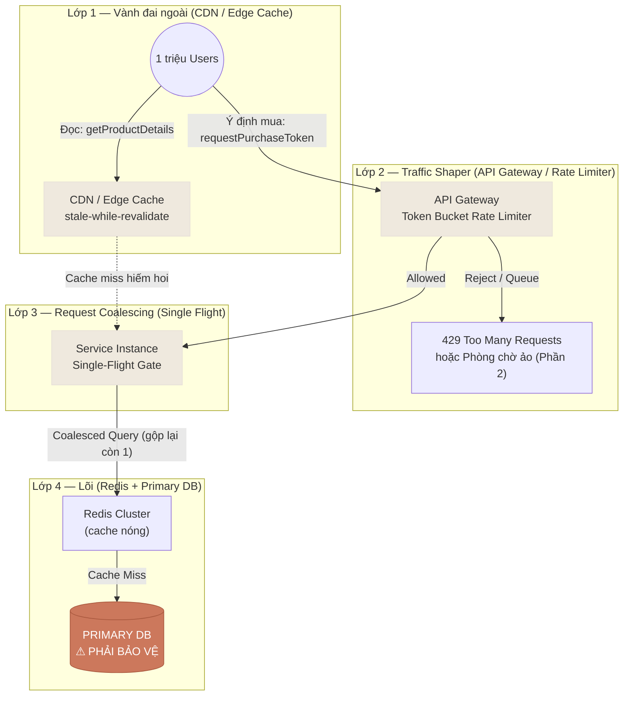

## 00:00:00 — Khoảnh khắc cả thế giới nhấn F5 cùng lúc

Hãy tưởng tượng đội marketing vừa tung ra một chương trình **giảm giá 90%**, bắt đầu *chính xác* lúc nửa đêm — `00:00:00`. Trong suốt cả tuần trước đó, hệ thống của bạn chạy phơ phớ với khoảng **1.000 QPS** (request mỗi giây). Êm đềm. Nhàn nhã.

Rồi đồng hồ điểm `00:00:00`.

Một triệu người dùng — những người đã canh me từ trước, ngón tay đặt sẵn trên nút refresh — nhấn F5 *cùng một lúc*. Trong vòng chưa đầy một giây, lưu lượng nhảy vọt từ `1.000 QPS` lên **`1.000.000 QPS`**. Gấp một nghìn lần.

Đây không phải là một cuộc tấn công của hacker. Đây là **một cuộc DDoS mà chính bạn tự gây ra cho mình** — khách hàng thật, tiền thật, nhưng cùng lúc cũng là một cơn sóng thần có thể nhấn chìm hệ thống. Hiện tượng này có tên: **Thundering Herd** (đàn thú giẫm đạp) — cả đàn lao về cùng một hướng, cùng một thời điểm.

Vấn đề cốt tử: **auto-scaling không thể cứu bạn.** Việc khởi tạo thêm máy chủ mất hàng chục giây đến vài phút. Nhưng cơn sóng ập đến trong *dưới một giây*. Khi máy mới vừa boot xong thì database đã sập từ lâu rồi — và một khi DB quan hệ (relational DB) bị quá tải, nó sẽ kéo theo **cascading failure**: connection pool cạn kiệt, query xếp hàng, timeout lan ra mọi tầng, toàn bộ hệ thống ngừng thở.

> **Nhiệm vụ của loạt bài này — và đặc biệt của Phần 1 — chỉ có một câu: *Sống sót qua giây đầu tiên.* Và bất biến (invariant) tối thượng: *Database lõi phải được bảo vệ bằng mọi giá.***

Chúng ta sẽ mô hình hóa **hai thao tác** xuyên suốt loạt bài:

- `getProductDetails(ProductID)` — đường **đọc** (read-heavy): xem chi tiết sản phẩm, ảnh, số lượng tồn kho. Đây là 99% lưu lượng.
- `requestPurchaseToken(UserID, ProductID)` — đường **ghi/ý định** (write/intent): "tôi muốn mua". Đây là phần ít hơn nhiều nhưng nguy hiểm hơn.

Và **ba ràng buộc** định hình mọi quyết định:

1. Tỷ lệ đọc/ghi cực kỳ chênh lệch (đọc áp đảo).
2. Burst tức thời — auto-scaling quá chậm để phản ứng.
3. Bảo vệ DB lõi là *bất biến*, không thương lượng.

## Kiến trúc: Phòng tuyến 4 lớp (4-layer perimeter defense)

Tư duy nền tảng: đừng để mọi request chạm tới lõi. Hãy dựng nhiều lớp phòng thủ đồng tâm, mỗi lớp lọc bớt một phần sóng, để đến tầng cuối cùng chỉ còn vài giọt nước chạm tới database.



Node màu **coral** chính là `PRIMARY DB` — thứ duy nhất chúng ta *không được phép* để sập. Mọi lớp phía trên tồn tại chỉ để giảm tải cho nó. Giờ ta đi qua từng nguyên lý.

## Nguyên lý 1 — Edge Caching & stale-while-revalidate

**Trực giác:** Bạn *không thể* xử lý 1 triệu request trong data center lõi. Nhưng bạn có thể đẩy chi tiết sản phẩm, ảnh, số tồn kho tĩnh ra **rìa mạng (edge)** — tới hàng trăm node CDN gần người dùng. 99% lưu lượng đọc được phục vụ ngay tại đó, không bao giờ chạm tới máy chủ của bạn.

**Analogy:** Hãy nghĩ CDN như những **kho hàng vệ tinh** đặt rải rác khắp thành phố. Thay vì để cả triệu người đổ về một nhà kho trung tâm duy nhất, mỗi người chỉ cần ghé kho gần nhất. Nhà kho trung tâm (DB lõi) gần như chẳng thấy ai.

Nhưng có một cái bẫy chết người: **cache stampede** (sự giẫm đạp khi cache hết hạn). Giả sử mục cache "Product 999" hết hạn lúc `00:00:05`. Ngay khoảnh khắc đó, *tất cả* client đang đọc nó cùng phát hiện cache trống và **cùng lao về origin** để lấy dữ liệu mới. Chính cái burst mà ta vừa chặn ở edge lại tái sinh — chỉ chậm 5 giây.

**Lời giải — `stale-while-revalidate`:** Khi mục cache hết hạn, CDN **không** chặn người dùng lại để chờ. Thay vào đó nó:

1. Phục vụ ngay dữ liệu **hơi cũ (stale)** cho *đa số* người dùng — họ không nhận ra khác biệt.
2. Đồng thời gửi **đúng một** request nền (async) về origin để làm mới.
3. Khi dữ liệu mới về, cache được cập nhật âm thầm.

Như vậy hàng nghìn request cùng đọc một key chỉ tạo ra *một* lượt làm mới. Trong thực tế, điều này thường được cấu hình ngay ở tầng CDN bằng header `Cache-Control: stale-while-revalidate=...`, chứ không phải code ở tầng ứng dụng. Dưới đây ta minh họa *cơ chế* đó bằng Go để hiểu nó vận hành ra sao.

```go
// Go 1.26 — minh họa cơ chế stale-while-revalidate ở tầng ứng dụng.
// Ý tưởng: trả dữ liệu cũ ngay lập tức, làm mới ngầm trong goroutine.
package swr

import (
	"sync"
	"time"
)

type entry struct {
	val       string
	expiresAt time.Time
}

type Cache struct {
	mu        sync.RWMutex
	data      map[string]entry
	ttl       time.Duration
	refreshFn func(key string) (string, error) // gọi origin/DB
	refreshing sync.Map                         // chống làm mới trùng cho cùng key
}

func New(ttl time.Duration, fn func(string) (string, error)) *Cache {
	return &Cache{data: map[string]entry{}, ttl: ttl, refreshFn: fn}
}

func (c *Cache) Get(key string) (string, bool) {
	c.mu.RLock()
	e, ok := c.data[key]
	c.mu.RUnlock()
	if !ok {
		return "", false // cache trống thật sự — caller phải đi lấy đồng bộ
	}
	if time.Now().After(e.expiresAt) {
		c.triggerRefresh(key) // hết hạn: vẫn TRẢ dữ liệu cũ, làm mới ở nền
	}
	return e.val, true
}

func (c *Cache) triggerRefresh(key string) {
	// LoadOrStore: chỉ goroutine ĐẦU TIÊN cho mỗi key được phép làm mới
	if _, busy := c.refreshing.LoadOrStore(key, true); busy {
		return // đã có người đang làm mới — không tạo thêm tải lên origin
	}
	go func() {
		defer c.refreshing.Delete(key)
		v, err := c.refreshFn(key)
		if err != nil {
			return // giữ nguyên dữ liệu cũ, thử lại ở lần truy cập sau
		}
		c.mu.Lock()
		c.data[key] = entry{val: v, expiresAt: time.Now().Add(c.ttl)}
		c.mu.Unlock()
	}()
}
```

## Nguyên lý 2 — Traffic Shaping tàn nhẫn với Token Bucket

**Trực giác:** Không phải mọi lưu lượng đều *chính đáng*. Trong cơn bão flash sale, một phần lớn request đến từ bot, từ retry tự động, từ những cú double-click hoảng loạn. Ta cần một cơ chế **shedding** (chủ động vứt bớt) — đặt ngay tại **API Gateway** để bảo vệ đường ghi `requestPurchaseToken`.

Thuật toán: **Token Bucket** (xô token).

**Analogy:** Hình dung một cái xô chứa các đồng token. Token được rót vào xô với một tốc độ cố định (ví dụ 5.000 token/giây — chính là "ngân sách request an toàn" mà backend chịu được). Mỗi request muốn đi qua phải **rút một token** ra. Còn token thì đi tiếp; hết token thì bị từ chối (`429 Too Many Requests`). Điều hay ho: xô có *dung lượng*, nên nếu trước đó vắng khách, token tích lại đầy xô — cho phép một **burst có kiểm soát** lúc cao điểm, rồi sau đó shaping gắt phần còn lại.

**Token Bucket vs Leaky Bucket — chọn cái nào?**

- **Leaky Bucket** xả ra với tốc độ *hằng định*, mượt như nước nhỏ giọt. Tuyệt cho các tác vụ nền đều đặn (background job).
- **Token Bucket** cho phép *bùng nổ trong giới hạn* rồi mới shaping. Flash sale bản chất là **bursty** — nên Token Bucket phù hợp hơn: ta cho phép tiêu thụ tới đúng năng lực backend, rồi gắt gao phần dư.

```go
// Go 1.26 — Token Bucket tại gateway bằng thư viện chuẩn mở rộng.
// import: golang.org/x/time/rate
package gateway

import (
	"net/http"

	"golang.org/x/time/rate"
)

// 5000 token/giây, dung lượng burst 8000 (đệm cho cú sốc đầu tiên).
var limiter = rate.NewLimiter(rate.Limit(5000), 8000)

func PurchaseHandler(w http.ResponseWriter, r *http.Request) {
	// Allow() rút 1 token; trả false ngay nếu hết — KHÔNG chặn luồng.
	if !limiter.Allow() {
		w.Header().Set("Retry-After", "2")
		http.Error(w, "Hệ thống đang quá tải, vui lòng thử lại", http.StatusTooManyRequests) // 429
		return
	}
	// Hợp lệ: KHÔNG cho đụng thẳng inventory/checkout.
	// Đẩy vào Phòng chờ ảo (Phần 2), nơi cấp purchase token có chữ ký.
	enqueueToWaitingRoom(w, r)
}

// AllowN dùng khi một thao tác "nặng" cần tốn nhiều token cùng lúc.
func canBatch(n int) bool { return limiter.AllowN(timeNow(), n) }
```

**Lưu ý thực chiến:** rate limiting **hiếm khi** chỉ dựa vào IP. NAT doanh nghiệp hay nhà mạng di động khiến hàng nghìn người dùng thật chia sẻ một IP — chặn IP là chặn nhầm khách thật. Trong thực tế, ta kết hợp nhiều tín hiệu: **user ID, session, product ID, device/risk signal**, và trạng thái đã qua kiểm tra ở edge. Bot bị chặn; người thật được chuyển vào phòng chờ.

## Nguyên lý 3 — Single-Flight / Request Coalescing

Đây là **vũ khí mạnh nhất** cho các điểm nóng read-heavy. Trực giác cực kỳ đơn giản nhưng hiệu quả khủng khiếp.

**Kịch bản:** Luồng (thread) số 1 hỏi "Product 999", nó **giành một khóa trong bộ nhớ** và bắt đầu gọi mạng/DB. Vài *micro giây* sau, luồng 2, 3, ... cho đến 10.000 cùng hỏi *đúng cùng một* Product 999. Thay vì mỗi luồng tự bắn một query xuống DB (= 10.000 query!), chúng **đăng ký "hóng" kết quả** của luồng 1. Khi luồng 1 nhận được payload, ứng dụng **phát kết quả đó cho tất cả** luồng đang chờ — đồng loạt.

**Kết quả:** 10.000 request đồng thời cùng key → **đúng MỘT** query backend.

**Analogy:** Như khi cả văn phòng cùng khát cà phê. Thay vì 10 người xếp hàng riêng lẻ ở quán, *một* người tình nguyện đi mua cho cả nhóm, ghi nhận đơn của mọi người, rồi mang về chia. Quán cà phê (DB) chỉ tiếp đúng một khách.

```go
// Go 1.26 — Request Coalescing bằng singleflight.
// import: golang.org/x/sync/singleflight
package coalesce

import (
	"context"
	"errors"
	"time"

	"golang.org/x/sync/singleflight"
)

var group singleflight.Group

// GetProduct: hàng nghìn lời gọi cùng key "product:999" gộp về 1 truy vấn DB.
func GetProduct(ctx context.Context, id string) (string, error) {
	key := "product:" + id
	// Bọc Do trong một timeout NGẮN — đây là điểm mấu chốt (xem Cạm bẫy).
	ctx, cancel := context.WithTimeout(ctx, 50*time.Millisecond)
	defer cancel()

	type result struct {
		val string
		err error
	}
	ch := group.DoChan(key, func() (any, error) {
		return queryDatabase(id) // CHỈ luồng đầu tiên thực sự chạy hàm này
	})

	select {
	case r := <-ch:
		if r.Err != nil {
			return "", r.Err
		}
		return r.Val.(string), nil
	case <-ctx.Done():
		// Quá 50ms: thất bại NHANH cho mọi waiter, rồi rơi về fallback.
		if errors.Is(ctx.Err(), context.DeadlineExceeded) {
			return "", errors.New("single-flight timeout — dùng dữ liệu dự phòng")
		}
		return "", ctx.Err()
	}
}
```

Lưu ý: phạm vi của single-flight là **per-process / per-shard** — mỗi tiến trình tự gộp request của nó. Gộp *toàn cục* (global coalescing) cần phối hợp phân tán và có thể tốn thêm độ trễ nhiều hơn cả phần nó tiết kiệm. Đừng tham.

## Triết lý: "Scale DOWN, not up" — Co lưu lượng lại, đừng phình máy chủ ra

Phản xạ tự nhiên của một kỹ sư là: "Tải tăng à? Thêm máy!". Nhưng scaling kiểu *phản ứng* (reactive) quá chậm cho flash sale. Ta phải **đảo ngược tư duy**: thay vì phình hạ tầng lên cho khớp lưu lượng, hãy **co lưu lượng xuống** cho khớp hạ tầng hiện có. Bốn trụ cột:

- **Pre-warming (làm nóng cache trước):** *"Một cache lạnh là một bản án tử."* Đừng để `00:00:00` mới bắt đầu nạp dữ liệu vào cache — lúc đó mọi request đều là cache miss và đổ thẳng xuống DB. Hãy nạp sẵn (warm) toàn bộ sản phẩm hot vào CDN và Redis **vài giờ trước** giờ G.
- **Graceful degradation (xuống cấp duyên dáng):** Nếu service gợi ý sản phẩm hay đánh giá (review) sập, thì *checkout vẫn phải sống*. Hãy chủ động **tắt các tính năng không thiết yếu** để dồn toàn bộ năng lực cho đường mua hàng.
- **Admission Control (kiểm soát nhập cảnh):** Phòng chờ ảo (Phần 2) biến burst hỗn loạn thành một dòng nhập cảnh *có kiểm soát*, cấp các purchase token ngắn hạn có chữ ký.
- **Triết lý cốt lõi:** *Ưu tiên kiểm soát việc cho vào (admission) hơn là tối đa hóa số người được chấp nhận.* Thà phục vụ tốt một dòng nhỏ còn hơn sập với cả đám đông.

## Mô phỏng: Thundering Herd với Single-Flight

Hãy tự tay cảm nhận sức mạnh của request coalescing. Widget dưới đây mô phỏng hàng nghìn request cùng đổ về một key "Product 999".

<div class="th-sim" style="border:1px solid var(--outlinegray);border-radius:14px;padding:20px 22px;margin:1.6em 0;background:var(--lightgray);font-family:var(--font-body)">
  <div style="display:flex;justify-content:space-between;align-items:center;margin-bottom:8px"><strong style="font-family:var(--font-header);color:var(--dark)">Mô phỏng Thundering Herd → DB</strong><span class="th-verdict" style="font-size:.85em;padding:3px 10px;border-radius:999px;background:var(--secondary);color:#fff">—</span></div>
  <canvas class="th-canvas" width="700" height="280" style="width:100%;height:auto;display:block;border-radius:8px"></canvas>
  <div style="display:flex;align-items:center;gap:12px;margin-top:10px;flex-wrap:wrap"><button class="th-toggle" type="button" style="border:none;cursor:pointer;background:var(--secondary);color:#fff;border-radius:8px;padding:7px 14px;font-family:var(--font-body)">Single-Flight: BẬT</button><span style="color:var(--gray);font-size:.85em">Số request:&nbsp;<span class="th-count" style="color:var(--dark);font-weight:600">3000</span></span><input class="th-slider" type="range" min="100" max="10000" value="3000" style="flex:1;min-width:140px;accent-color:var(--secondary)"></div>
  <div style="display:flex;justify-content:space-between;margin-top:8px;font-size:.85em;color:var(--gray)"><span>DB hits: <span class="th-hits" style="color:var(--tertiary);font-weight:700">0</span></span><span>Đã gửi: <span class="th-sent" style="color:var(--dark);font-weight:600">0</span></span></div>
  <script>(function(){var root=document.currentScript.closest('.th-sim');if(!root||root.dataset.init)return;root.dataset.init='1';var cv=root.querySelector('.th-canvas'),ctx=cv.getContext('2d'),W=cv.width,H=cv.height;var slider=root.querySelector('.th-slider'),btn=root.querySelector('.th-toggle'),verdict=root.querySelector('.th-verdict'),elHits=root.querySelector('.th-hits'),elSent=root.querySelector('.th-sent'),elCount=root.querySelector('.th-count');var css=getComputedStyle(root);function c(n){return css.getPropertyValue(n).trim()||'#888';}var COL_GRAY=c('--gray'),COL_SEC=c('--secondary'),COL_TER=c('--tertiary'),COL_DARK=c('--dark'),COL_LINE=c('--outlinegray');var sf=true,total=3000,hits=0,sent=0,dots=[],gateY=H/2,gateX=W*0.5,dbX=W*0.86,spawnAcc=0,coalesced=false;function reset(){hits=0;sent=0;dots=[];coalesced=false;}function spawn(){if(sent>=total)return;var n=Math.min(total-sent,Math.ceil(total/120));for(var i=0;i<n;i++){dots.push({x:10,y:30+Math.random()*(H-60),s:1.4+Math.random()*1.1,phase:0});sent++;}}function step(){spawnAcc++;if(spawnAcc%1===0)spawn();for(var i=dots.length-1;i>=0;i--){var d=dots[i];if(d.phase===0){d.x+=d.s*2.2;d.y+=(gateY-d.y)*0.04;if(d.x>=gateX){if(sf){coalesced=true;dots.splice(i,1);continue;}else{hits++;d.phase=1;}}}else{d.x+=d.s*2.4;if(d.x>=dbX){hits++;dots.splice(i,1);}}}if(sf&&coalesced&&sent>0&&hits===0){hits=1;}draw();elHits.textContent=hits;elSent.textContent=sent;requestAnimationFrame(step);}function draw(){ctx.clearRect(0,0,W,H);ctx.strokeStyle=COL_LINE;ctx.lineWidth=2;ctx.beginPath();ctx.moveTo(gateX,20);ctx.lineTo(gateX,H-20);ctx.stroke();ctx.fillStyle=COL_GRAY;ctx.font='13px sans-serif';ctx.fillText('Users',8,16);ctx.fillStyle=sf?COL_SEC:COL_GRAY;ctx.fillText(sf?'Single-Flight Gate':'No Gate',gateX-46,16);ctx.fillStyle=COL_TER;ctx.fillRect(dbX,gateY-34,40,68);ctx.fillStyle='#fff';ctx.font='11px sans-serif';ctx.fillText('DB',dbX+11,gateY+4);for(var i=0;i<dots.length;i++){var d=dots[i];ctx.beginPath();ctx.fillStyle=d.phase===1?COL_TER:COL_SEC;ctx.arc(d.x,d.y,2.6,0,7);ctx.fill();}}function recolor(){btn.style.background=sf?COL_SEC:COL_TER;btn.textContent='Single-Flight: '+(sf?'BẬT':'TẮT');verdict.style.background=sf?COL_SEC:COL_TER;verdict.textContent=sf?'1 DB hit':total.toLocaleString()+' DB hits';}slider.addEventListener('input',function(){total=parseInt(slider.value,10);elCount.textContent=total;reset();recolor();});btn.addEventListener('click',function(){sf=!sf;reset();recolor();});recolor();step();})();</script>
</div>

> **Thử ngay:** Kéo thanh trượt lên `10000` request. Với **Single-Flight BẬT** (coral), chú ý "DB hits" dừng ở **1** — mọi request gộp lại tại cổng. Bấm nút để **TẮT** Single-Flight: giờ *mỗi* request xuyên thẳng qua cổng và "DB hits" leo lên hàng nghìn. Đó chính là sự khác biệt giữa sống và sập.

## Cạm bẫy thường gặp

- **Bẫy auto-scaling:** Scaling phản ứng (reactive) tốt cho tăng trưởng tự nhiên, nhưng *vô dụng* trước burst dưới-1-giây. Đừng đặt cược sự sống còn vào việc boot máy mới kịp giờ.
- **Cache stampede:** Một key nóng hết hạn → tất cả client đồng loạt đánh origin. Luôn dùng `stale-while-revalidate` hoặc làm mới có khóa.
- **Cache lạnh = bản án tử:** Khởi động sale với cache trống nghĩa là 100% cache miss đổ xuống DB. **Pre-warm** trước hàng giờ.
- **Single-Flight là SPOF:** Nếu luồng số 1 *treo*, *tất cả* waiter cũng treo theo. Phải đặt **timeout gắt (~50ms)**: hết giờ thì nhả khóa, retry hoặc fail tức thì toàn bộ waiter để rơi về fallback. *Thất bại nhanh tốt hơn luồng treo.*
- **Rate limit chỉ theo IP sẽ hỏng:** NAT doanh nghiệp và nhà mạng di động gộp nhiều người thật vào một IP. Hãy kết hợp user ID, session, product, device/risk signal.
- **Chi phí gộp toàn cục:** Global coalescing cần phối hợp phân tán; đôi khi độ trễ điều phối còn lớn hơn phần tiết kiệm được. Giữ phạm vi per-process/per-shard.
- **Số request thô ≠ nhu cầu thật:** Lưu lượng bị thổi phồng bởi bot, double-click, retry, bão refresh. Shaping gắt **không** làm mất đơn thật — nó bảo toàn lõi để lượng hàng giới hạn được bán đúng.
- **Quên graceful degradation:** Khi quá tải, đừng để service phụ kéo sập checkout. Hãy tắt tính năng phụ chủ động.

## Tóm tắt: Mental model

- **Tín hiệu (Signal):** Một cú tăng đột biến *tức thời* về cả đọc lẫn ghi, dồn vào *một tài nguyên logic duy nhất*.
- **Cấu trúc (Structure):** Edge Caching + Traffic Shaping + Request Coalescing — ba lớp lọc đồng tâm.
- **Bất biến (Invariant):** Năng lực DB trong ngắn hạn là *cố định*; lưu lượng phải được lọc / shaping / xếp hàng **trước khi** vượt qua ranh giới lõi.
- **Insight cốt lõi (Pivot):** Auto-scaling là *phản ứng* (ổn với tăng trưởng tự nhiên); flash sale cần *chủ động* shedding + coalescing.

> **Phản xạ cần khắc cốt:** *Đừng cố hứng cả cơn sóng thần; hãy xây đê chắn sóng, gộp các con sóng lại, và chỉ để những gợn nước chạm tới database.*

---
## Liên quan
- [[flash-sale-admission-control|Phần 2: Admission Control & Phòng chờ ảo]]
- [[flash-sale-distributed-inventory|Phần 3: Tồn kho phân tán & Hot-Row]]
- [[flash-sale-payment-idempotency|Phần 4: Thanh toán & Idempotency phân tán]]
