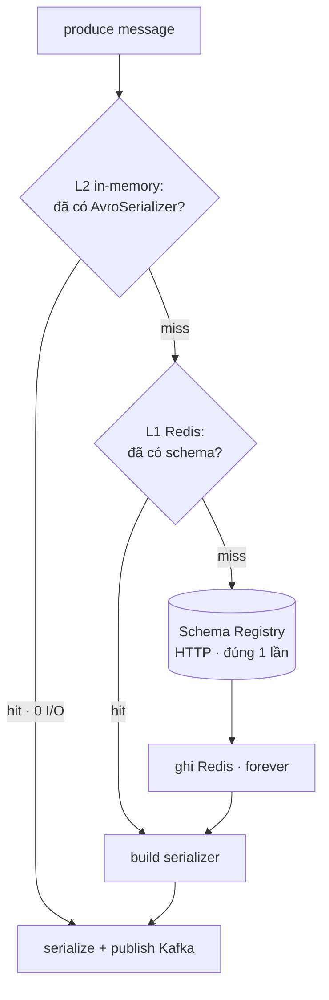

> Câu chuyện debug một incident `502 Bad Gateway` từ Schema Registry, lần ngược về tận kiến trúc cache của thư viện, rồi refactor thành **2 tầng cache** để producer hầu như không còn phụ thuộc Schema Registry trong vận hành thường ngày.

Đây là một bug rất "đặc trưng": code *trông như* đã có cache, test functional vẫn xanh, nhưng khi downstream sự cố mới lòi ra là hệ thống đang gọi origin nhiều hơn dự kiến **gấp hàng nghìn lần**. Bài học không nằm ở Kafka — nó nằm ở chỗ *hiểu vòng đời object và runtime model*.

## 1. Triệu chứng ban đầu

Một producer Avro gửi sự kiện qua Kafka, schema được resolve qua **Confluent Schema Registry**. Một ngày, log Horizon worker spam:

```text
Error when produce avro message:
  Invalid message body received - cannot find "error_code" field in response body
  "<html>
   <head><title>502 Bad Gateway</title></head>
   <body><center><h1>502 Bad Gateway</h1></center>
   <hr><center>nginx</center></body>
  </html>"
```

Đọc kỹ: client Schema Registry gọi HTTP, nhận về **HTML 502 từ nginx**, parse JSON thất bại. Đây không phải bug code Kafka — Schema Registry phía upstream đang sự cố, và **client gọi vào đó mỗi lần produce**.

Câu hỏi đặt ra: *thư viện này có cache không? Nếu có thì sao mỗi message vẫn HTTP?*

## 2. Đào vào code hiện trạng

Code cũ trong `KafkaAvroProducer::getAvroSerializer()`:

```php
final protected function getAvroSerializer(string $topic, KafkaMessage $message): AvroSerializer
{
    $cachedRegistry = new CachedRegistry(
        new BlockingRegistry(
            new PromisingRegistry(
                new Client(['base_uri' => config('kafka.schema_registry.url'), 'verify' => false])
            )
        ),
        new AvroObjectCacheAdapter      // ← in-memory cache
    );

    $registry = new AvroSchemaRegistry($cachedRegistry);
    $recordSerializer = new RecordSerializer($cachedRegistry);
    $avroSchema = $this->getAvroSchema($topic);
    $message->withVersion($avroSchema->getVersion());
    $registry->addBodySchemaMappingForTopic($topic, $this->getAvroSchema($topic));

    return new AvroSerializer($registry, $recordSerializer);
}
```

Trông có vẻ ổn — có `CachedRegistry`, có `AvroObjectCacheAdapter`. Nhưng để ý kỹ:

> `CachedRegistry` và `AvroObjectCacheAdapter` được **khởi tạo mới hoàn toàn** trong scope của method, **mỗi lần** `produce()` **gọi**.

`AvroObjectCacheAdapter` cache trong field `private $idToSchema = []` của instance. Mỗi lần `getAvroSerializer()` chạy → `new AvroObjectCacheAdapter` → array rỗng → hết scope → bị garbage collected.

**Nghĩa là**: cache về danh nghĩa thì có, thực tế **không bao giờ hit**. Worker process vẫn còn sống, nhưng cache thì biến mất sau mỗi method call. Mỗi message → 2 HTTP call lên Schema Registry. Khi Schema Registry hắt hơi 502, tất cả message produce trong khoảng đó đều fail. → **Bug #1.**

## 3. Đào tiếp: `LATEST_VERSION` cố tình bypass cache

Đọc vendor code, phát hiện thêm một chi tiết. Trong `CachedRegistry::latestVersion()`:

```php
/**
 * The latest version should not be cached, it might already be replaced
 * by a newly registered 'latest' version.
 */
public function latestVersion(string $subject)
{
    return $this->registry->latestVersion($subject);   // ← BỎ QUA CACHE
}
```

Và trong constructor của `KafkaAvroSchema`:

```php
public function __construct(
    private readonly string $schemaName,
    private readonly int $version = KafkaAvroSchemaRegistry::LATEST_VERSION,  // = -1
    // ...
)
```

Code cũ tạo `new KafkaAvroSchema(schemaName: $name)` **không truyền version** → mặc định `LATEST_VERSION`. Khi cần schema definition, nó chạy nhánh:

```php
// AvroSchemaRegistry::getSchemaDefinition
if ($avroSchema->getVersion() === KafkaAvroSchemaRegistry::LATEST_VERSION) {
    return $this->registry->latestVersion($avroSchema->getName());  // ← bypass cache
}
return $this->registry->schemaForSubjectAndVersion($name, $version);  // ← cached
```

Tức là dù có fix bug #1, vẫn còn nhánh `latestVersion()` **được thiết kế để không cache**. → **Bug #2.**

Vì sao thư viện cố tình không cache `latest`? Vì `latest` có thể đổi bất kỳ lúc nào khi schema mới được publish. Cache forever cho `latest` → producer stuck với schema cũ mãi mãi. Quyết định hợp lý — nhưng đồng nghĩa: muốn hưởng cache, producer phải **pin một version cụ thể**.

## 4. Hiểu runtime model của PHP trước khi chọn cache

Một câu hỏi tự nhiên: *"PHP là shared-nothing, mỗi request một process — vậy in-memory cache có ích gì?"* Câu trả lời tuỳ runtime.

**Model A — PHP-FPM / mod_php:** mỗi HTTP request là một process mới (bootstrap → handle → die). In-memory cache bị xoá sạch giữa các request → vô dụng. Phải dùng cache phân tán (Redis/Memcached).

**Model B — long-running worker (Horizon, `queue:work`, Octane, RoadRunner):** một process xử lý hàng trăm/nghìn job liên tiếp rồi mới restart (chạm `--max-jobs`). Singleton trong Laravel container **persist xuyên suốt vòng đời worker** → in-memory cache có ý nghĩa.

```text
Model A (FPM):  req → process → die        req → process → die      (cache mất sạch mỗi req)
Model B (Horizon): worker ──job1──job2── … ──job1000── restart       (singleton sống xuyên job)
```

Producer này chạy trên Horizon = **Model B**, đáng lẽ in-memory cache hoạt động. Nhưng code cũ `new CachedRegistry` **mỗi method call** (biến local, không phải singleton) → bị GC ngay → lợi thế Model B bị vô hiệu hoá. Bug #1 quay lại.

Thậm chí với Model B, in-memory đơn thuần vẫn không đủ vì 3 edge case:

1. **Worker restart** (max-jobs, OOM, deploy) → cache reset → lần produce đầu sau restart vẫn HTTP. Nếu Schema Registry đang 502 đúng lúc đó → fail.
2. **Multi-pod trên k8s** — mỗi pod warmup độc lập. N pod = N lần HTTP cho mỗi schema.
3. **Web request cũng produce** (nếu có) → rơi vào Model A, in-memory vô dụng.

→ Quyết định: dùng **Redis** (cross-pod, cross-restart, cross-model) làm tầng cache chính, **in-memory là tầng L2** ngồi trên Redis để giảm I/O trong cùng worker.

## 5. Thiết kế 2-tier cache



- **L2 — in-memory mỗi worker:** `$serializerCache[$topic]` → một `AvroSerializer` đã build sẵn. Sống = vòng đời 1 worker process.
- **L1 — Redis cross-pod:** `CachedRegistry → SimpleCacheAdapter → Laravel Cache → Redis`. Key `<subject>_<version>` và `<md5_hash>`. Sống = forever.
- **Origin:** `GET /subjects/<name>/versions/<version>` lên Schema Registry — chỉ chạm khi cả 2 tầng đều miss.

### Tại sao cache Redis "forever" lại an toàn?

Theo convention Confluent, schema tại một cặp `(subject, version)` là **immutable** — schema mới = publish thành version *mới*. Vì vậy:

- Key `order.created.value_3` mãi mãi trỏ về cùng một schema string → cache forever không bao giờ stale.
- Khi publish version 4 → code đọc config `version=4` → key Redis mới `order.created.value_4` → miss → HTTP đúng 1 lần → cached. Key `..._3` thành rác vô hại.

### Tại sao cần L2 ngồi trên L1?

Mỗi lần serialize, thư viện vẫn gọi `CachedRegistry::schemaId()` → 2 Redis GET riêng biệt (`hasSchemaIdForHash` + `getIdWithHash`). Trong một burst hàng nghìn message cùng topic, đó là 2 I/O Redis mỗi message. L2 giữ luôn `AvroSerializer` đã build (đã set sẵn `definition`) → message thứ 2 trở đi **bỏ qua hoàn toàn cả Redis lookup lẫn** `AvroSchema::parse()`.

## 6. Triển khai

### 6.1 Bind `CachedRegistry` thành singleton

```php
// KafkaServiceProvider.php
$this->app->singleton(CachedRegistry::class, function () {
    $client = new Client([
        'base_uri'        => config('kafka.schema_registry.url'),
        'verify'          => false,
        'timeout'         => (float) config('kafka.schema_registry.timeout', 10),
        'connect_timeout' => (float) config('kafka.schema_registry.connect_timeout', 10),
    ]);

    /** @var CacheRepository $cache */
    $cache = Cache::store(config('kafka.schema_registry.cache_store', 'redis'));

    return new CachedRegistry(
        new BlockingRegistry(new PromisingRegistry($client)),
        new SimpleCacheAdapter($cache)   // ← Redis làm tầng L1
    );
});

$this->app->singleton(KafkaProducer::class, function ($app) {
    if (config('kafka.serializer.type') === 'json') {
        return new KafkaJsonProducer;
    }
    return new KafkaAvroProducer($app->make(CachedRegistry::class));
});
```

Điểm tinh tế: `Illuminate\Contracts\Cache\Repository` đã `extends Psr\SimpleCache\CacheInterface`, nên truyền thẳng vào `SimpleCacheAdapter` mà không cần wrap thêm.

### 6.2 Truyền version vào `KafkaAvroSchema`

```php
protected function getAvroSchema(string $topic): KafkaAvroSchema
{
    $topics = config('kafka.topics');

    return new KafkaAvroSchema(
        schemaName: $topics[$topic]['schema_name'],
        version:    (int) $topics[$topic]['version'],   // ← chìa khoá để cache hoạt động
    );
}
```

```php
// config/kafka.php
'topics' => [
    'order.created' => [
        'schema_name' => 'order.created.value',
        'version'     => env('ORDER_CREATED_TOPIC_VERSION', 1),
    ],
    // ...
],
```

Bump schema = update env + restart Horizon. **Đánh đổi:** phải có quy trình deploy khi schema đổi. **Lợi:** cache an toàn 100%, không race condition.

### 6.3 L2 cache trong producer

```php
class KafkaAvroProducer extends AbstractKafkaProducer implements KafkaProducer
{
    /** @var array<string, AvroSerializer> */
    private array $serializerCache = [];

    public function __construct(private readonly CachedRegistry $cachedRegistry) {}

    final protected function getAvroSerializer(string $topic, KafkaMessage $message): AvroSerializer
    {
        $avroSchema = $this->getAvroSchema($topic);
        $message->withVersion($avroSchema->getVersion());   // luôn set version cho mỗi message

        if (isset($this->serializerCache[$topic])) {
            return $this->serializerCache[$topic];          // ← L2 hit · 0 I/O
        }

        $registry = new AvroSchemaRegistry($this->cachedRegistry);
        $registry->addBodySchemaMappingForTopic($topic, $avroSchema);

        return $this->serializerCache[$topic] = new AvroSerializer(
            $registry,
            new RecordSerializer($this->cachedRegistry),
        );
    }
}
```

Producer được bind singleton → `$serializerCache` sống cùng worker process. (Lưu ý đặt `$message->withVersion()` *ngoài* nhánh cache để mỗi message vẫn được gắn version đúng.)

### 6.4 Cấu hình mở rộng

```php
// config/kafka.php
'schema_registry' => [
    'url'             => env('KAFKA_SCHEMA_REGISTRY_URL', 'http://localhost:8081'),
    'timeout'         => env('KAFKA_SCHEMA_REGISTRY_TIMEOUT', 10),
    'connect_timeout' => env('KAFKA_SCHEMA_REGISTRY_CONNECT_TIMEOUT', 10),
    'cache_store'     => env('KAFKA_SCHEMA_REGISTRY_CACHE_STORE', 'redis'),
],
```

Timeout nên tinh chỉnh theo môi trường — DNS trong k8s thường cần dung sai cao hơn local.

## 7. Verify bằng log thực tế

Thêm log tạm vào 4 điểm: `cached_registry_initialized` (singleton lần đầu resolve), `l2_cache_miss_built_serializer` (L2 build mới), `l2_cache_hit` (DEBUG), `produce_success` (kèm `elapsed_ms`).

**Test 1 — chạy từ CLI (`php artisan ...`):** mỗi message là một PID khác nhau → đúng Model A, L2 vô dụng. Nhưng `elapsed_ms` giảm `317 → 242` giữa 2 process khác nhau → **bằng chứng Redis (L1) đang chạy**: process thứ 2 không hit HTTP Schema Registry nữa.

**Test 2 — bật `php artisan horizon`:**

| Phase | elapsed_ms | Nguyên nhân |
| --- | --- | --- |
| Cold (lần đầu / worker / topic) | ~318ms | Build serializer + parse schema + 2 Redis GET (cold) |
| Warm (L2 hit) | ~175ms | Chỉ còn Kafka publish + 2 Redis GET cho schemaId |
| **Tiết kiệm** | **~145ms (−46%)** | L2 cache + Redis warm |

Cùng một PID xử lý nhiều message liên tiếp → từ message thứ 2 bỏ qua schema parse + lookup. L2 xác nhận hoạt động.

**Test 3 — đổi version qua env rồi restart:** log `l2_cache_miss` và header `schema_version` đều phản ánh đúng version mới; kiểm tra trực tiếp Redis:

```shell
redis-cli KEYS "*order.created*"
# order.created.value_3   ← cũ, không đọc nữa
# order.created.value_4   ← mới, đang dùng
```

Hãy tự "bắn" message thử ở dưới để thấy hai kiến trúc cũ/mới hành xử khác nhau ra sao khi Schema Registry sập:

<div class="kc-sim" style="border:1px solid var(--outlinegray);border-radius:14px;padding:20px 22px;margin:1.6em 0;background:var(--lightgray);font-family:var(--font-body)">
  <div style="display:flex;flex-wrap:wrap;justify-content:space-between;align-items:baseline;gap:8px;margin-bottom:8px"><strong style="font-family:var(--font-header);font-size:1.05em;color:var(--dark)">Mô phỏng 2-tier cache</strong><span class="kc-verdict" style="font-size:.85em;padding:3px 10px;border-radius:999px;background:var(--secondary);color:#fff;white-space:nowrap"></span></div>
  <canvas class="kc-canvas" width="700" height="200" style="width:100%;height:auto;display:block"></canvas>
  <div style="display:flex;flex-wrap:wrap;gap:16px;margin:10px 2px;font-size:.88em;color:var(--gray)"><span><b style="color:var(--gray)">●</b> L2 in-mem ~175ms</span><span><b style="color:var(--tertiary)">●</b> L1 Redis ~220ms</span><span><b style="color:var(--secondary)">●</b> Origin HTTP ~318ms</span><span style="margin-left:auto;color:var(--dark)">HTTP→SR: <b class="kc-http">0</b> · Fail: <b class="kc-fail" style="color:var(--secondary)">0</b></span></div>
  <div style="display:flex;flex-wrap:wrap;align-items:center;gap:12px"><button class="kc-fire" type="button" style="border:none;cursor:pointer;background:var(--secondary);color:#fff;border-radius:8px;padding:7px 14px;font-family:var(--font-body);font-size:.88em">⚡ Bắn 1 message</button><button class="kc-burst" type="button" style="border:1px solid var(--outlinegray);cursor:pointer;background:var(--light);color:var(--dark);border-radius:8px;padding:7px 14px;font-family:var(--font-body);font-size:.88em">⚡⚡ Bắn 30</button><label style="font-size:.85em;color:var(--gray);display:flex;align-items:center;gap:6px"><input class="kc-arch" type="checkbox" checked> Kiến trúc mới (singleton + pin version)</label><label style="font-size:.85em;color:var(--gray);display:flex;align-items:center;gap:6px"><input class="kc-502" type="checkbox"> Schema Registry 502</label><button class="kc-reset" type="button" style="border:1px solid var(--outlinegray);cursor:pointer;background:var(--light);color:var(--dark);border-radius:8px;padding:7px 14px;font-family:var(--font-body);font-size:.88em">Reset</button></div>
  <script>(function(){var root=document.currentScript.closest('.kc-sim');if(!root||root.dataset.init)return;root.dataset.init='1';var cv=root.querySelector('.kc-canvas'),ctx=cv.getContext('2d'),W=cv.width,H=cv.height;function css(v){return (getComputedStyle(document.documentElement).getPropertyValue(v)||v).trim();}var $=function(s){return root.querySelector(s);};var topics=['order.created','payment.captured','user.updated'];var l1=Object.create(null),l2=Object.create(null),hist=[],http=0,fail=0,total=0,n=0,ti=0;function reset(){l1=Object.create(null);l2=Object.create(null);hist=[];http=0;fail=0;total=0;n=0;ti=0;draw();}function fire(){var newArch=$('.kc-arch').checked,sr502=$('.kc-502').checked;var topic=topics[ti%topics.length];ti++;n++;var tier,ms,failed=false;if(!newArch){tier='origin';if(sr502){failed=true;}ms=sr502?0:318;}else{if(l2[topic]){tier='l2';ms=175;}else if(l1[topic]){tier='l1';ms=220;l2[topic]=true;}else{tier='origin';if(sr502){failed=true;ms=0;}else{l1[topic]=true;l2[topic]=true;ms=318;}}}if(tier==='origin'&&!failed)http++;if(failed)fail++;if(!failed)total+=ms;hist.push({tier:tier,failed:failed,topic:topic});if(hist.length>46)hist.shift();draw();}function draw(){ctx.clearRect(0,0,W,H);var lanes=[{y:38,c:'--gray',n:'L2 in-mem'},{y:90,c:'--tertiary',n:'L1 Redis'},{y:142,c:'--secondary',n:'Origin (Schema Registry)'}];ctx.font='11px sans-serif';lanes.forEach(function(L){ctx.fillStyle=css('--gray');ctx.fillText(L.n,8,L.y-14);ctx.strokeStyle=css('--outlinegray');ctx.beginPath();ctx.moveTo(8,L.y);ctx.lineTo(W-8,L.y);ctx.stroke();});var bw=13,gap=2,x0=W-8-hist.length*(bw+gap);hist.forEach(function(h,i){var y=h.tier==='l2'?38:h.tier==='l1'?90:142;var x=x0+i*(bw+gap);if(h.failed){ctx.strokeStyle=css('--secondary');ctx.lineWidth=2;ctx.beginPath();ctx.moveTo(x,y-9);ctx.lineTo(x+bw,y+9);ctx.moveTo(x+bw,y-9);ctx.lineTo(x,y+9);ctx.stroke();ctx.lineWidth=1;}else{ctx.fillStyle=css(h.tier==='l2'?'--gray':h.tier==='l1'?'--tertiary':'--secondary');ctx.globalAlpha=h.tier==='l2'?0.55:0.9;ctx.beginPath();ctx.arc(x+bw/2,y,6,0,7);ctx.fill();ctx.globalAlpha=1;}});$('.kc-http').textContent=http;$('.kc-fail').textContent=fail;var v=$('.kc-verdict');var newArch=$('.kc-arch').checked,sr502=$('.kc-502').checked;if(n===0){v.textContent='Bấm "Bắn message"';v.style.background='var(--gray)';}else if(!newArch&&sr502){v.textContent='❌ Code cũ + SR 502 → MỌI message fail';v.style.background='var(--secondary)';}else if(!newArch){v.textContent='⚠️ Code cũ: mỗi message vẫn HTTP lên SR ('+http+')';v.style.background='var(--tertiary)';}else if(sr502){var coldFails=fail>0;v.textContent=coldFails?('⚠️ Chỉ '+fail+' message cold-miss fail; topic đã warmup thì miễn nhiễm'):'✅ Đã warmup → SR 502 KHÔNG ảnh hưởng';v.style.background=coldFails?'var(--tertiary)':'var(--secondary)';}else{var avg=n-fail>0?Math.round(total/(n-fail)):0;v.textContent='✅ Mới: '+http+' HTTP cho '+topics.length+' topic · avg '+avg+'ms';v.style.background='var(--secondary)';}}$('.kc-fire').addEventListener('click',function(){fire();});$('.kc-burst').addEventListener('click',function(){var i=0,t=setInterval(function(){fire();if(++i>=30)clearInterval(t);},45);});$('.kc-reset').addEventListener('click',reset);$('.kc-arch').addEventListener('change',reset);$('.kc-502').addEventListener('change',draw);draw();})();</script>
</div>

> Bật **"Schema Registry 502"** rồi bắn 30 message: với **code cũ** mọi message fail (mỗi message một HTTP call); với **kiến trúc mới**, chỉ vài message cold-miss đầu tiên (mỗi topic 1 lần) có thể fail, còn lại được L1/L2 phục vụ và **miễn nhiễm** với sự cố của Schema Registry.

## 8. Bài học rút ra

**8.1 "Có cache trong code" ≠ "cache hoạt động".** `new CachedRegistry(...)` trong method body là cache về mặt cú pháp, nhưng vì biến local → instance bị throw away ngay → effective hit rate = 0%. Quy tắc: **cache state phải persist ở scope phù hợp với use case.**

- Cache cho 1 request → property của object xử lý request.
- Cache cho vòng đời worker → singleton trong container.
- Cache cross-process → Redis/Memcached.

**8.2 Đọc kỹ contract của thư viện.** `latestVersion()` không cache là *quyết định thiết kế có chủ ý*, ghi rõ trong comment vendor. Không đọc → tưởng cache toàn diện → đặt config sai (không pin version) → cache chạy một nửa, chậm mà không hiểu vì sao. Đọc source vendor không phải xa xỉ — là yêu cầu khi tích hợp library vào critical path.

**8.3 Hiểu runtime model trước khi chọn cache strategy.** Cùng một đoạn code trên PHP-FPM và Horizon hành xử rất khác. In-memory đủ cho long-running worker, vô dụng cho web request. Redis là mẫu số chung nhưng có cost I/O → **dùng cả 2 tầng**.

**8.4 Log là cầu nối giữa giả thuyết và sự thật.** Review code xong có thể "tin rằng" cache chạy. Nhưng chỉ khi nhìn log thật với `pid` và `elapsed_ms` mới *chắc chắn* — và đo được con số cụ thể (−46%). Log timing là công cụ chẩn đoán rẻ nhất, hiệu quả nhất. Xong việc thì bỏ log đo, giữ lại các log "hiếm khi xảy ra" như `cached_registry_initialized` để chẩn đoán về sau.

## 9. Kết quả

**Trước fix:** mỗi message → 2 HTTP lên Schema Registry; SR 502 → toàn bộ message trong window fail; latency phụ thuộc hoàn toàn vào SR.

**Sau fix:** mỗi `(subject, version)` chỉ HTTP lên SR **1 lần cho cả cluster** (cache Redis vĩnh viễn); mỗi `(worker, topic)` chỉ build serializer 1 lần rồi L2 hit; producer **không còn phụ thuộc SR** trong vận hành thường ngày cho schema đã warmup → 502 transient không gây mất message; latency p50 ~175ms steady-state (chủ yếu là Kafka publish, không còn schema resolve).

> Bug performance trong cache layer thường không hiện ra qua test functional — chúng chỉ lộ khi downstream sự cố và bạn nhận ra hệ thống đang gọi origin nhiều hơn dự kiến. Đầu tư đọc vendor source, hiểu runtime, và đo log timing có ROI rất cao cho loại bug này.

---
## Liên quan
- [[polling-realtime-etag|Polling cho realtime + ETag]] — cũng là câu chuyện "đừng gọi origin khi không cần", ở tầng HTTP
- [[flash-sale-payment-idempotency|Flash Sale Phần 4: Thanh toán & Idempotency]] — Kafka như xương sống sự kiện & ingest bất đồng bộ
- [[tactical-vs-strategic-programming|Tactical vs Strategic Programming]] — "cache trông như có mà không chạy" là một vết nợ kỹ thuật ẩn điển hình
