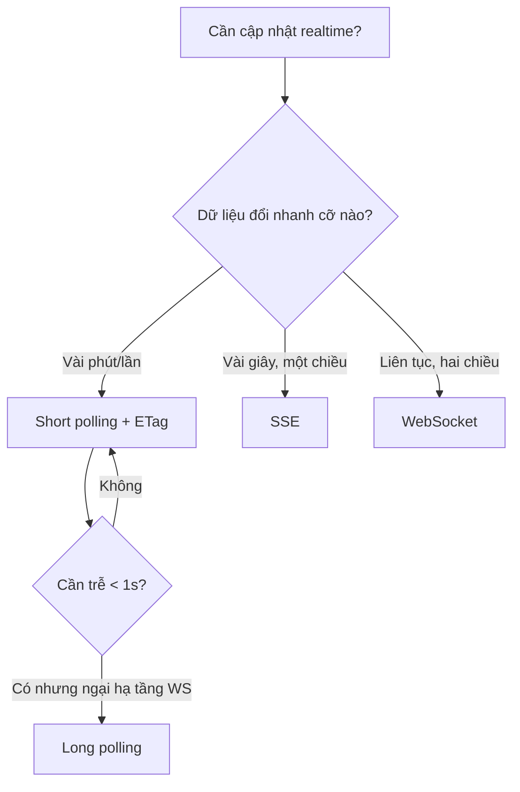
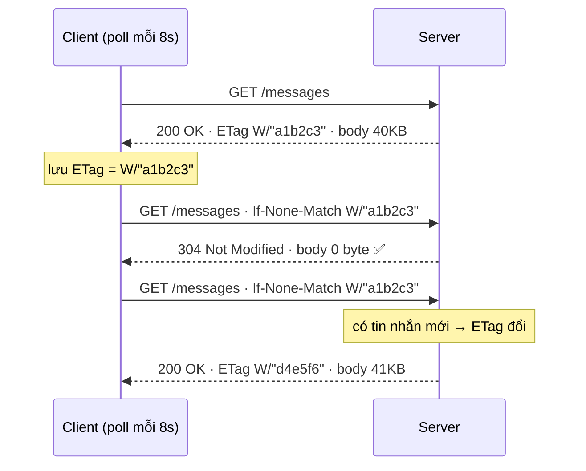

Bạn có một trang chat (hoặc livestream, hoặc dashboard) cần "cập nhật gần như tức thời". Cách đơn giản nhất ai cũng nghĩ tới: cứ **vài giây gọi lại API một lần** — gọi là *polling*. Nó dễ đến mức bị xem thường, nhưng làm sai thì đốt băng thông, đốt quota API, và tạo ra một cơn *thundering herd* nho nhỏ của chính bạn.

Bài này gom lại cách làm polling cho **đúng**, và mẹo quan trọng nhất để nó **rẻ**: dùng `ETag` + `If-None-Match` để server trả `304 Not Modified` (body rỗng) khi dữ liệu chưa đổi.

> Bối cảnh thực tế truyền cảm hứng cho bài này: một trang chat đồng bộ tin nhắn từ Facebook Graph API bằng polling — `refetchInterval` 8s cho tin nhắn, 20s cho danh sách hội thoại, và `refetchIntervalInBackground: false` để **ngừng poll khi tab bị ẩn** (khỏi đốt quota). Đó chính là 3 quyết định cốt lõi mà ta sẽ mổ xẻ.

## Bức tranh lớn: 4 cách "đẩy" dữ liệu về client

Trước khi tối ưu polling, phải biết khi nào KHÔNG nên polling.

| Kỹ thuật | Cơ chế | Độ trễ | Khi nào dùng |
|---|---|---|---|
| **Short polling** | Client hỏi lại sau mỗi N giây | ~N/2 giây | Dữ liệu đổi chậm (phút), cần đơn giản, hạ tầng HTTP sẵn có |
| **Long polling** | Server *giữ* request đến khi có thay đổi (hoặc timeout) | gần tức thì | Cần realtime hơn nhưng không muốn WebSocket |
| **SSE** (Server-Sent Events) | 1 kết nối HTTP một chiều, server đẩy event | tức thì | Feed một chiều: notification, giá, log |
| **WebSocket** | Kênh 2 chiều full-duplex | tức thì | Chat 2 chiều, game, collaborative editing |



**Nguyên tắc:** đừng nhảy thẳng lên WebSocket vì nghe "xịn". Chat của bạn cập nhật mỗi phút một lần thì short polling + ETag vừa rẻ vừa đơn giản, lại tận dụng toàn bộ hạ tầng HTTP (CDN, cache, load balancer, retry) sẵn có. WebSocket kéo theo cả một gánh nặng vận hành: sticky session, heartbeat, reconnect, scale fan-out.

## Short polling làm đúng: 3 quyết định sống còn

Polling "ngây thơ" là `setInterval(fetchAll, 8000)`. Nó hỏng ở 3 chỗ.

### 1. Dừng poll khi người dùng không nhìn

Tab bị ẩn (chuyển tab, minimize) mà vẫn poll = đốt băng thông và **quota API** vô ích. Với React Query (TanStack Query), đây là một cờ:

```ts
// constants.ts — đặt hằng số ở một chỗ, dễ chỉnh
export const MESSAGE_POLL_INTERVAL_MS = 8_000;       // tin nhắn trong hội thoại đang mở
export const CONVERSATION_POLL_INTERVAL_MS = 20_000; // danh sách hội thoại

// fb-chat-api.ts
export function useFBMessages(conversationId: string) {
  return useQuery({
    queryKey: ['fb-messages', conversationId],
    queryFn: () => fetchMessages(conversationId),
    refetchInterval: MESSAGE_POLL_INTERVAL_MS,
    refetchIntervalInBackground: false, // ⬅️ tab ẩn → NGỪNG poll, khỏi đốt quota Graph API
    staleTime: MESSAGE_POLL_INTERVAL_MS, // tránh refetch chồng khi component remount
  });
}
```

`refetchIntervalInBackground: false` là mặc định nhưng **phải hiểu vì sao**: nó gắn nhịp poll với `document.visibilityState`. `staleTime` thì khác — nó nói "dữ liệu còn tươi trong N ms, đừng refetch lại khi mount hay focus lại cửa sổ", giúp chặn các lần gọi thừa ngoài nhịp interval.

### 2. Khác interval cho khác mức độ "nóng"

Tin nhắn trong hội thoại đang mở = nóng → 8s. Danh sách hội thoại (chỉ cần biết có tin mới ở đâu) = nguội hơn → 20s. **Đừng poll mọi thứ cùng một nhịp.** Tách query, tách interval.

### 3. Jitter — tránh "thundering herd" của chính bạn

Nếu 10.000 client cùng `setInterval(_, 8000)` và họ mở trang gần như cùng lúc (ví dụ ngay sau một thông báo push), các nhịp poll sẽ **đồng pha** và đập vào server thành từng đợt sóng. Thêm một chút ngẫu nhiên (jitter) để rải đều:

```ts
// Rải nhịp poll ±15% để các client không đồng pha
function jitter(baseMs: number, ratio = 0.15): number {
  const delta = baseMs * ratio;
  return baseMs - delta + Math.random() * 2 * delta;
}
// dùng: refetchInterval: () => jitter(MESSAGE_POLL_INTERVAL_MS)
```

> Đây chính xác là vấn đề mà [[flash-sale-admission-control|phòng chờ ảo ở Phần 2 của series Flash Sale]] phải xử lý: client poll trạng thái hàng đợi mà không có jitter sẽ tạo ra một "thundering herd thứ cấp". Cùng một bài học, hai bối cảnh.

## Mẹo lớn nhất: ETag + 304 để không tải lại dữ liệu cũ

Đây là phần đắt giá. Vấn đề: response của bạn có thể là **vài chục KB** (kể cả đã gzip), nhưng dữ liệu chỉ đổi mỗi ~1 phút. Vậy là cứ 8 giây bạn tải lại vài chục KB **y hệt** — lãng phí ~7 trên 8 lần.

`ETag` giải quyết đúng điều đó. Cơ chế là **HTTP conditional request**:

1. Lần đầu, server trả `200 OK` kèm header `ETag: W/"a1b2c3"` — một "chữ ký" của nội dung.
2. Client lưu ETag đó, các lần sau gửi kèm `If-None-Match: W/"a1b2c3"`.
3. Server so sánh: **nội dung chưa đổi** → trả `304 Not Modified` với **body rỗng**. Đổi rồi → trả `200` + body mới + ETag mới.



Một response `304` chỉ nặng vài trăm byte (chỉ có header). So với 40KB, đó là tiết kiệm ~99% băng thông cho mỗi lần poll "rỗng".

### Strong vs Weak ETag

- **Strong** `ETag: "abc"` — cam kết giống nhau **từng byte**. Cần cho range request.
- **Weak** `ETag: W/"abc"` — chỉ cần "tương đương về mặt ngữ nghĩa". Với JSON API polling, **weak là lựa chọn đúng**: bạn chỉ quan tâm "nội dung có thực sự đổi không", không quan tâm vài byte khác biệt do thứ tự field hay timestamp footer.

### Phía server: tự sinh ETag và trả 304

Nhiều framework làm sẵn (Express bật ETag mặc định; Fastify cần `@fastify/etag`; Nginx tự ETag cho file tĩnh nhưng **không** cho API proxy). Nhưng để hiểu bản chất, đây là một handler tự viết bằng Go 1.26:

```go
// Go 1.26 — tính weak ETag từ nội dung, trả 304 khi không đổi
func messagesHandler(w http.ResponseWriter, r *http.Request) {
	body := currentMessagesJSON() // []byte payload hiện tại của hội thoại

	sum := sha256.Sum256(body)
	etag := fmt.Sprintf(`W/"%x"`, sum[:8]) // weak validator, lấy 8 byte đầu cho gọn
	w.Header().Set("ETag", etag)
	w.Header().Set("Cache-Control", "no-cache") // luôn revalidate, đừng dùng bản cũ một cách mù quáng

	// So khớp ETag client gửi lên. (Production: parse danh sách + so sánh weak cho chuẩn RFC.)
	if slices.Contains(parseIfNoneMatch(r.Header.Get("If-None-Match")), etag) {
		w.WriteHeader(http.StatusNotModified) // 304, KHÔNG ghi body
		return
	}
	w.Header().Set("Content-Type", "application/json")
	w.Write(body)
}
```

Điểm tinh tế: `Cache-Control: no-cache` **không** có nghĩa "cấm cache". Nó nghĩa là "được cache, nhưng phải revalidate với server (bằng ETag) trước khi dùng". Đúng tinh thần polling: luôn hỏi, nhưng hỏi rẻ.

### Phía client: đọc 304 và tái dùng dữ liệu cũ

Trình duyệt có thể tự xử lý conditional request một cách trong suốt — nhưng khi bạn muốn **chủ động** kiểm soát (và đo được khi nào dữ liệu đổi), hãy tự gắn `If-None-Match`:

```ts
// fetcher có nhận biết ETag: 304 → trả lại dữ liệu cũ, 0 byte body
let lastEtag: string | null = null;
let lastData: Message[] = [];

async function fetchMessages(id: string): Promise<Message[]> {
  const res = await fetch(`/api/conversations/${id}/messages`, {
    headers: lastEtag ? { 'If-None-Match': lastEtag } : {},
    cache: 'no-store', // để TA tự lo conditional request, không để browser cache đè
  });
  if (res.status === 304) return lastData; // ⬅️ chưa đổi: tái dùng, không parse lại, không re-render
  lastEtag = res.headers.get('ETag');
  lastData = (await res.json()) as Message[];
  return lastData;
}
```

Mẹo của bài Viblo gốc còn nhẹ hơn nữa: kể cả không đọc được status 304 (do browser nuốt mất), bạn vẫn có thể **so sánh `ETag` của response với ETag lần trước** để quyết định có cập nhật UI hay không — chặn được những lần re-render thừa dù body vẫn về.

## Bảng so sánh: bao nhiêu băng thông được cứu?

Giả sử body 40KB (gzip), poll 8s, dữ liệu đổi mỗi 60s. Trong 1 phút có ~7-8 lần poll, chỉ 1 lần thực sự đổi:

- **Không ETag:** 8 × 40KB ≈ **320 KB/phút/client**
- **Có ETag:** 1 × 40KB + 7 × ~0.3KB ≈ **42 KB/phút/client** → cứu ~**87%**

Nhân với 10.000 client đang online, đó là khác biệt giữa **3.2 GB/phút** và **0.42 GB/phút**. Hãy tự kéo thử bên dưới:

<div class="poll-sim" style="border:1px solid var(--outlinegray);border-radius:14px;padding:20px 22px;margin:1.6em 0;background:var(--lightgray);font-family:var(--font-body)">
  <div style="display:flex;flex-wrap:wrap;justify-content:space-between;align-items:baseline;gap:8px;margin-bottom:8px"><strong style="font-family:var(--font-header);font-size:1.05em;color:var(--dark)">Mô phỏng băng thông polling</strong><span class="poll-verdict" style="font-size:.85em;padding:3px 10px;border-radius:999px;background:var(--secondary);color:#fff;white-space:nowrap"></span></div>
  <canvas class="poll-canvas" width="700" height="170" style="width:100%;height:auto;display:block"></canvas>
  <div style="display:flex;flex-wrap:wrap;gap:18px;margin:10px 2px;font-size:.9em;color:var(--gray)"><span><b class="poll-200" style="color:var(--secondary)">●</b> 200 (tải đủ ~40KB)</span><span><b class="poll-304" style="color:var(--gray)">●</b> 304 (rỗng ~0.3KB)</span><span style="margin-left:auto;color:var(--dark)">Tổng tải: <b class="poll-total"></b></span></div>
  <div style="display:flex;flex-wrap:wrap;align-items:center;gap:12px"><button class="poll-play" type="button" style="border:none;cursor:pointer;background:var(--secondary);color:#fff;border-radius:8px;padding:7px 14px;font-family:var(--font-body);font-size:.88em">▶ Chạy</button><label style="font-size:.85em;color:var(--gray);display:flex;align-items:center;gap:6px"><input class="poll-etag" type="checkbox" checked> Bật ETag/304</label><label style="font-size:.85em;color:var(--gray);flex:1;display:flex;align-items:center;gap:8px">Nhịp poll <input class="poll-int" type="range" min="2" max="20" value="8" style="flex:1;accent-color:var(--secondary)"> <b class="poll-int-v" style="color:var(--dark)">8s</b></label></div>
  <script>(function(){var root=document.currentScript.closest('.poll-sim');if(!root||root.dataset.init)return;root.dataset.init='1';var cv=root.querySelector('.poll-canvas'),ctx=cv.getContext('2d');var W=cv.width,H=cv.height;function css(v){return getComputedStyle(document.documentElement).getPropertyValue(v)||v;}var $=function(s){return root.querySelector(s);};var ticks=[],clock=0,nextPoll=0,nextChange=14,total=0,timer=null;function reset(){ticks=[];clock=0;nextPoll=0;nextChange=8+Math.random()*30;total=0;}function step(){var etag=$('.poll-etag').checked;var iv=+$('.poll-int').value;$('.poll-int-v').textContent=iv+'s';clock+=1;if(clock>=nextChange){nextChange=clock+30+Math.random()*40;ticks.push({t:clock,kind:'change'});}if(clock>=nextPoll){nextPoll=clock+iv;var changedSince=ticks.some(function(x){return x.kind==='change'&&!x.used;});var full=!etag||changedSince;ticks.forEach(function(x){if(x.kind==='change')x.used=true;});ticks.push({t:clock,kind:full?'200':'304'});total+=full?40:0.3;}if(clock>120){reset();}draw();}function draw(){ctx.clearRect(0,0,W,H);var base=H-34,scale=(W-20)/120;ctx.strokeStyle=css('--outlinegray');ctx.lineWidth=1;ctx.beginPath();ctx.moveTo(10,base);ctx.lineTo(W-10,base);ctx.stroke();ticks.forEach(function(x){if(x.kind==='change')return;var px=10+x.t*scale;var h=x.kind==='200'?70:14;ctx.fillStyle=x.kind==='200'?css('--secondary'):css('--gray');ctx.globalAlpha=x.kind==='200'?0.9:0.55;ctx.fillRect(px-3,base-h,6,h);ctx.globalAlpha=1;});ticks.forEach(function(x){if(x.kind!=='change')return;var px=10+x.t*scale;ctx.strokeStyle=css('--tertiary');ctx.setLineDash([3,3]);ctx.beginPath();ctx.moveTo(px,10);ctx.lineTo(px,base);ctx.stroke();ctx.setLineDash([]);ctx.fillStyle=css('--tertiary');ctx.font='10px sans-serif';ctx.fillText('data đổi',px-18,9);});var cx=10+Math.min(clock,120)*scale;ctx.strokeStyle=css('--dark');ctx.globalAlpha=.4;ctx.beginPath();ctx.moveTo(cx,10);ctx.lineTo(cx,base);ctx.stroke();ctx.globalAlpha=1;ctx.fillStyle=css('--gray');ctx.font='11px sans-serif';ctx.fillText('giây '+clock,W-70,H-8);$('.poll-total').textContent=(total>=1000?(total/1000).toFixed(1)+' MB':Math.round(total)+' KB');var full=ticks.filter(function(x){return x.kind==='200';}).length,e304=ticks.filter(function(x){return x.kind==='304';}).length;var v=$('.poll-verdict');if(!$('.poll-etag').checked){v.textContent='❌ Không ETag: mọi lần poll đều tải đủ';v.style.background='var(--secondary)';}else if(full+e304===0){v.textContent='Bấm ▶ Chạy';v.style.background='var(--gray)';}else{var saved=Math.round(e304/(full+e304)*100);v.textContent='✅ '+e304+'/'+(full+e304)+' lần là 304 — cứu ~'+saved+'% băng thông';v.style.background='var(--secondary)';}}$('.poll-play').addEventListener('click',function(){if(timer){clearInterval(timer);timer=null;this.textContent='▶ Chạy';return;}this.textContent='⏸ Dừng';if(clock>=120)reset();timer=setInterval(step,90);});$('.poll-int').addEventListener('input',draw);$('.poll-etag').addEventListener('change',function(){reset();draw();});draw();})();</script>
</div>

> Kéo nhịp poll, bật/tắt **ETag**: các cột thấp màu xám là `304` (gần như miễn phí), cột cao màu coral là `200` (tải đủ ~40KB), vạch đứt là lúc dữ liệu thực sự đổi. Với ETag bật, gần như mọi lần poll đều rơi vào 304 — chỉ tốn băng thông đúng lúc có tin mới.

## Khi short polling không đủ: long polling

Nếu bạn cần độ trễ dưới một giây mà chưa muốn lên WebSocket, **long polling** là bước trung gian: client gửi request, server **giữ kết nối mở** cho đến khi có thay đổi (hoặc hết timeout ~30s) rồi mới trả lời; client nhận xong là gọi lại ngay.

```go
// Go 1.26 — long polling: chặn tối đa 30s chờ tin mới
func longPollHandler(w http.ResponseWriter, r *http.Request) {
	ctx, cancel := context.WithTimeout(r.Context(), 30*time.Second)
	defer cancel()

	select {
	case msg := <-subscribe(r.PathValue("conversationID")): // có tin mới
		writeJSON(w, msg)
	case <-ctx.Done(): // hết 30s, trả rỗng để client poll lại ngay
		w.WriteHeader(http.StatusNoContent) // 204
	}
}
```

Long polling cho cảm giác "tức thì" nhưng tốn connection hơn (mỗi client giữ một request treo) — đúng cái bẫy "connection exhaustion" đã bàn ở [[flash-sale-admission-control|Phần 2 Flash Sale]]. Khi số client lớn, hãy cân nhắc SSE/WebSocket.

## Cạm bẫy thường gặp

1. **Poll khi tab ẩn** → đốt quota/băng thông vô ích. Luôn gắn nhịp poll với `visibilityState` (`refetchIntervalInBackground: false`).
2. **Không có jitter** → 10.000 client đồng pha tạo sóng tải. Rải nhịp ±10-20%.
3. **Quên `Cache-Control`** → không có chính sách revalidate rõ ràng, browser hoặc proxy có thể trả bản cũ hoặc bỏ qua ETag. Dùng `no-cache` (revalidate) cho API polling.
4. **Proxy/CDN nuốt mất ETag** → Nginx mặc định **không** sinh ETag cho upstream API; gzip giữa đường có thể đổi/loại ETag. Kiểm tra header thực tế đến tay client.
5. **304 vẫn tốn một round-trip** → ETag cứu *băng thông body*, không cứu *số lượng request*. Nếu request quá dày, phải giảm tần suất hoặc đổi sang SSE/WebSocket — ETag không thay được điều đó.
6. **So ETag sai chuẩn** → `If-None-Match` có thể chứa danh sách nhiều ETag và cần so sánh **weak**; so chuỗi thô đôi khi sai. Dùng thư viện framework khi có thể.
7. **Poll vẫn chạy chồng** khi component remount → đặt `staleTime` để tránh refetch ngoài nhịp.
8. **Dùng nhầm WebSocket cho mọi thứ** → gánh nặng vận hành (sticky session, reconnect, fan-out) không đáng nếu dữ liệu đổi mỗi phút.

## Tóm tắt: Mental model

- **Tín hiệu:** cần dữ liệu "tươi" định kỳ, dữ liệu đổi chậm, hạ tầng HTTP sẵn có, không muốn độ phức tạp của WebSocket.
- **Cấu trúc:** Short polling theo nhịp phù hợp + dừng khi tab ẩn + jitter + **ETag/`If-None-Match`/`304`** để cắt băng thông body.
- **Bất biến:** mỗi lần poll vẫn là một round-trip — ETag cắt *kích thước*, không cắt *số lần*; muốn cắt số lần thì giảm tần suất hoặc đổi mô hình (SSE/WebSocket).
- **Insight cốt lõi:** polling không "kém sang"; polling *ngây thơ* mới kém. Polling có jitter + visibility-aware + ETag là một giải pháp realtime rẻ, bền, và tận dụng được toàn bộ hạ tầng web.

> Đừng hỏi "tin mới đâu?" rồi tải về cả cuốn sổ mỗi 8 giây. Hãy hỏi "có gì đổi so với chữ ký `a1b2c3` không?" — và để server trả lời "không" bằng một gói 0 byte.

---
## Liên quan
- [[flash-sale-admission-control|Flash Sale Phần 2: Admission Control & Phòng chờ ảo]] — polling có jitter & retry_after để tránh thundering herd thứ cấp
- [[flash-sale-thundering-herd|Flash Sale Phần 1: Thundering Herd]] — stale-while-revalidate & lá chắn cache ở biên
