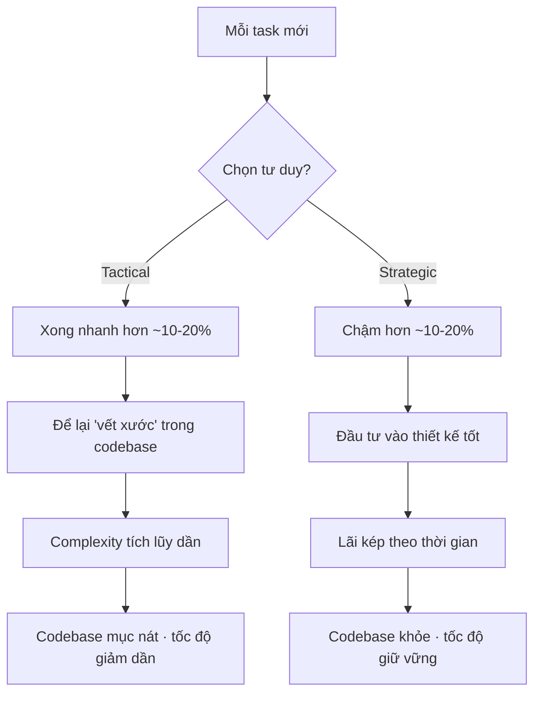

Đây là một chương trung tâm trong cuốn **"A Philosophy of Software Design"** của **John Ousterhout** (cùng tác giả với câu trích về Complexity ở slide đầu tiên). Đây có lẽ là một trong những phân loại có ảnh hưởng nhất mà Ousterhout đưa ra — nó phân chia lập trình viên thành hai "trường phái tư duy" với hậu quả rất khác nhau về lâu dài.

## Định nghĩa cốt lõi

### Tactical Programming (Lập trình chiến thuật)

**Mục tiêu duy nhất: làm cho task hiện tại xong càng nhanh càng tốt.**

Lập trình viên tactical (gọi là *"tactical tornado"* — cơn lốc chiến thuật) suy nghĩ kiểu:

> *"Tôi cần fix bug này / thêm feature này. Cách nhanh nhất là gì? OK, làm theo cách đó. Xong. Tiếp theo."*

Họ không quan tâm nhiều đến:
- Code có sạch không
- Thiết kế có hợp lý không
- Người sau sẽ đọc code này thế nào
- Hệ thống sẽ ra sao sau 1 năm nữa

Họ chỉ quan tâm: **task này, hôm nay, xong chưa?**

### Strategic Programming (Lập trình chiến lược)

**Mục tiêu: tạo ra một thiết kế tốt, đồng thời hoàn thành task.**

Lập trình viên strategic suy nghĩ:

> *"Tôi cần fix bug / thêm feature này. Nhưng tôi cũng đang đầu tư vào một codebase mà tôi (và team) sẽ làm việc trong nhiều năm. Cách nào vừa làm xong task, vừa làm cho hệ thống tốt hơn (hoặc ít nhất là không tệ đi)?"*

Họ chấp nhận **chậm hơn một chút ở hiện tại** để đổi lấy **tốc độ lâu dài**.

## Sự đánh đổi cốt lõi

Ousterhout đưa ra một con số ước lượng (không phải con số chính xác, mà là để minh họa):

> Lập trình strategic sẽ làm bạn **chậm hơn khoảng 10-20%** ở giai đoạn đầu so với tactical.

Nghe có vẻ tactical là người chiến thắng. **Nhưng đây là cái bẫy.**

## Tại sao Tactical Programming thất bại về lâu dài

Đây là phần đắt giá nhất của chương. Ousterhout chỉ ra: **mỗi lần bạn lập trình tactical, bạn để lại một "vết xước" nhỏ trong codebase.**

Một vết xước = một quyết định thiết kế tệ, một shortcut, một copy-paste, một abstraction tệ, một cái tên xấu, một module nhồi nhét chức năng không liên quan...

Mỗi vết xước **nhỏ thôi**. Không vết nào đủ tệ để khiến bạn dừng lại fix. Mỗi cái chỉ làm bạn chậm thêm 1%.

**Nhưng chúng tích lũy.**

Sau 6 tháng, codebase có 500 vết xước. Sau 1 năm, có 2000 vết xước. Đến một lúc, **complexity tích lũy đủ lớn để bóp nghẹt tốc độ phát triển**:

- Feature mới mất gấp đôi thời gian, rồi gấp ba
- Bug xuất hiện ở những chỗ không ngờ tới
- Không ai dám refactor vì sợ làm vỡ thứ khác
- Lập trình viên mới mất hàng tháng mới hiểu được code
- Cả team trở nên **sợ codebase của chính mình**

Đây là điều mà ai làm phần mềm lâu năm đều thấy: **một dự án bắt đầu rất nhanh, rồi chậm dần, rồi đến lúc thêm 1 feature đơn giản cũng mất 2 tuần**. Không phải vì lập trình viên kém đi — mà vì **complexity đã thắng**.

## "Tactical Tornado" — Cơn lốc tàn phá

Ousterhout dùng cụm từ rất hay: **Tactical Tornado** — chỉ những lập trình viên cực kỳ "tactical".

Đặc điểm:
- Hoàn thành task **rất nhanh**
- Được sếp khen vì "năng suất cao"
- Được khen thưởng, thăng chức
- **Nhưng họ đi đến đâu, codebase mục nát đến đó**

Sau khi họ rời đi (hoặc chuyển sang dự án khác), team còn lại phải sống chung với một mớ hỗn độn họ để lại — và phải mất nhiều **tháng/năm** để dọn dẹp.

Điểm bi kịch: **trong nhiều công ty, tactical tornado được coi là ngôi sao**, vì các thước đo ngắn hạn (số task hoàn thành, tốc độ ship feature) không bắt được tác hại dài hạn họ gây ra. Khi codebase sụp đổ, người đó đã đi xa rồi, và những người ở lại bị đổ lỗi.

## Strategic Programming hoạt động thế nào?

Ousterhout không đòi hỏi bạn phải **redesign cả hệ thống** mỗi lần làm task. Đó là tactical extremism ngược chiều, cũng tệ.

Ý ông là: **mỗi task, hãy đầu tư một chút vào thiết kế.**

Ví dụ:
- Khi thêm feature mới, hãy nghĩ: *"Cách tôi tổ chức code này có làm nó dễ mở rộng sau không?"*
- Khi sửa bug, hãy hỏi: *"Tại sao bug này xảy ra ngay từ đầu? Có cách nào sửa thiết kế để loại cả lớp bug tương tự không?"*
- Khi thấy code xấu **trên đường đi qua**, dọn dẹp một chút (boy scout rule: "leave it cleaner than you found it")
- Đôi khi, **dừng lại refactor trước**, sau đó mới làm task — vì refactor giúp task dễ hơn nhiều

Đầu tư mỗi lần một chút (5-10%) → tích lũy thành một codebase ngày càng tốt hơn theo thời gian, chứ không phải ngày càng tệ.

## Tính toán "khoản đầu tư"

Ousterhout đưa ra một mô hình tư duy thú vị: hãy coi strategic programming là **đầu tư tài chính**.

Mỗi lần bạn dành 10% thời gian thêm để làm thiết kế tốt hơn → đó là khoản đầu tư.

**Khoản đầu tư đó trả lãi** mỗi lần bạn (hoặc người khác) đụng vào code đó trong tương lai — vì code dễ hiểu, dễ sửa, ít bug hơn.

Sau vài tháng, lãi tích lũy đã vượt khoản đầu tư ban đầu. Sau 1 năm, bạn được "lãi kép" — code tốt giúp bạn làm task tiếp theo nhanh hơn, lại càng có thời gian đầu tư vào thiết kế tốt hơn → vòng xoáy tích cực.

**Ngược lại, tactical programming là vay nợ** (technical debt). Bạn "tiết kiệm" thời gian hôm nay, nhưng phải trả lãi (cao) mỗi lần đụng vào code đó sau này. Cuối cùng, **lãi vay nhiều đến mức bạn không còn thời gian làm gì khác ngoài trả nợ**.

  

    <strong style="font-family:var(--font-header);font-size:1.05em;color:var(--dark)">Mô phỏng: Tổng năng suất tích luỹ theo thời gian</strong>
    
  

  <svg class="tsv-svg" viewBox="0 0 720 340" style="width:100%;height:auto;display:block;overflow:visible">
    <line class="tsv-axis" x1="56" y1="300" x2="700" y2="300" stroke="var(--outlinegray)" stroke-width="1.5"></line>
    <line class="tsv-axis" x1="56" y1="20" x2="56" y2="300" stroke="var(--outlinegray)" stroke-width="1.5"></line>
    <path class="tsv-area-t" fill="var(--gray)" opacity="0.08"></path>
    <path class="tsv-area-s" fill="var(--secondary)" opacity="0.12"></path>
    <polyline class="tsv-line-t" fill="none" stroke="var(--gray)" stroke-width="2.5" stroke-dasharray="6 5" stroke-linecap="round"></polyline>
    <polyline class="tsv-line-s" fill="none" stroke="var(--secondary)" stroke-width="3" stroke-linecap="round"></polyline>
    <circle class="tsv-cross" r="5" fill="none" stroke="var(--primary)" stroke-width="2"></circle>
    <line class="tsv-marker" y1="20" y2="300" stroke="var(--dark)" stroke-width="1" opacity="0.45"></line>
    <circle class="tsv-dot-t" r="5" fill="var(--gray)"></circle>
    <circle class="tsv-dot-s" r="5.5" fill="var(--secondary)"></circle>
    <text x="690" y="318" text-anchor="end" font-size="12" fill="var(--gray)">Tháng →</text>
  </svg>
  

     Tactical — <b class="tsv-val-t" style="color:var(--dark)"></b>
     Strategic — <b class="tsv-val-s" style="color:var(--secondary)"></b>
    Tháng <b class="tsv-month"></b>
  

  

    <button class="tsv-play" type="button" style="border:none;cursor:pointer;background:var(--secondary);color:#fff;border-radius:8px;padding:7px 14px;font-family:var(--font-body);font-size:.88em">▶ Tự chạy</button>
    <input class="tsv-slider" type="range" min="0" max="24" value="10" style="flex:1;accent-color:var(--secondary)">
  

  

> Kéo thanh trượt (hoặc bấm **Tự chạy**): những tháng đầu **Tactical** dẫn trước vì bỏ qua thiết kế; nhưng quanh **tháng ~10** là *điểm hoà vốn*, sau đó **Strategic** vượt lên nhờ "lãi kép" — đúng luận điểm của Ousterhout. (Đây là HTML/JS nhúng thẳng trong note — cơ chế giống Artifacts của Claude.)

## Khi nào tactical là chấp nhận được?

Ousterhout không phải kẻ cứng nhắc. Ông thừa nhận có những lúc tactical là đúng:

- **Prototype dùng một lần** để thử ý tưởng → tactical OK, vì code sẽ vứt đi
- **Demo cho hackathon, MVP cho startup chứng minh ý tưởng** → tactical OK
- **Code thử nghiệm, throw-away script** → tactical OK

Nhưng có một **cái bẫy** rất phổ biến: nhiều dự án bắt đầu như "prototype tạm" → code tactical → ai ngờ thành công → tiếp tục build trên nền prototype đó → **không bao giờ refactor** → 5 năm sau vẫn là một mớ hỗn độn trên nền prototype.

Quy tắc của Ousterhout: **bất kỳ code nào sẽ tồn tại > 6 tháng và có nhiều người làm việc → phải strategic.**

## Trở ngại tâm lý và tổ chức

Tại sao strategic programming khó áp dụng dù ai cũng biết nó tốt?

**1. Áp lực deadline ngắn hạn.** "Ship cuối tuần này!" → ai cũng tactical để kịp.

**2. Văn hóa khen thưởng sai.** Công ty thường thưởng "ship được nhiều feature", không thưởng "giữ code sạch". Vậy ai dại đầu tư vào thiết kế?

**3. Khó đo lường.** Bạn không thấy được benefit của strategic programming ngay — phải chờ vài tháng/năm. Trong khi cost (chậm 10%) thì thấy ngay → tâm lý dễ chọn tactical.

**4. Mindset cá nhân.** Lập trình viên trẻ thường tự hào về tốc độ → mặc định tactical. Phải qua đủ "đau thương" với codebase hỏng nát mới hiểu giá trị của strategic.

## Lời khuyên thực tế

Ousterhout đưa ra một heuristic đơn giản: **dành khoảng 10-20% thời gian cho thiết kế.**

Cụ thể:
- Trước khi viết code, dành vài phút **nghĩ về thiết kế** (không phải nhảy vào code ngay)
- Khi gặp một quyết định nhỏ về thiết kế, dành thêm 1-2 phút **so sánh các phương án**, chọn cái tốt nhất (không phải cái nghĩ ra đầu tiên)
- Khi thấy code xấu **trên đường đi**, dọn dẹp một chút
- Định kỳ (hàng tuần?) dành thời gian **refactor** những chỗ tệ nhất

Đầu tư này nhỏ, nhưng tích lũy theo thời gian sẽ tạo ra **khác biệt khổng lồ giữa một codebase còn sống được sau 5 năm và một codebase bị viết lại từ đầu**.

## Kết nối với các slide trước

Slide này hoàn toàn nhất quán với mạch tư duy đang được xây dựng:

- **Complexity** là kẻ thù chính của phần mềm (Ousterhout)
- **Software Entropy** — code mục nát tự nhiên qua "broken windows" (Thomas & Hunt)
- **Tactical programming** chính là **cơ chế chính tạo ra entropy và complexity** — mỗi shortcut tactical = một broken window mới
- **Strategic programming** = chủ động chống lại entropy bằng cách **liên tục đầu tư vào thiết kế** thay vì tích lũy nợ

Ousterhout về cơ bản đang trả lời câu hỏi: *"Vì sao codebase mục nát?"* Câu trả lời của ông: **vì lập trình viên chọn tactical mỗi ngày, và những lựa chọn nhỏ đó cộng dồn thành thảm họa.**

## Tóm gọn

- **Tactical programming**: Tối ưu cho task hiện tại, bỏ qua thiết kế dài hạn → nhanh trước mắt, chậm dài hạn
- **Strategic programming**: Mỗi task đều đầu tư một chút vào thiết kế tốt → chậm trước mắt (10-15%), nhưng nhanh dài hạn rất nhiều
- **Tactical tornado** = ngôi sao của công ty mà cũng là kẻ phá hoại lớn nhất của codebase
- **Bài học**: Phần mềm là một marathon, không phải sprint. Tốc độ thực sự không phải tốc độ của task đầu tiên, mà là **tốc độ trung bình qua nhiều năm**. Strategic programming là cách duy nhất để giữ tốc độ đó cao.

Câu nói đáng nhớ của Ousterhout tóm tắt tất cả:

> *"The most effective approach is to think strategically. The mindset you need is: 'good design doesn't really cost much in the long run.'"*

Thiết kế tốt không phải là **xa xỉ** — nó là **đầu tư có lãi cao nhất** mà một lập trình viên có thể làm.

---
## Liên quan
- [[complexity-ousterhout|Complexity của Ousterhout]]
- [[software-entropy|Software Entropy]]
- [[the-design-concept|The Design Concept (Brooks)]]
- [[small-steps-feedback|Bước nhỏ + Feedback loop]]
